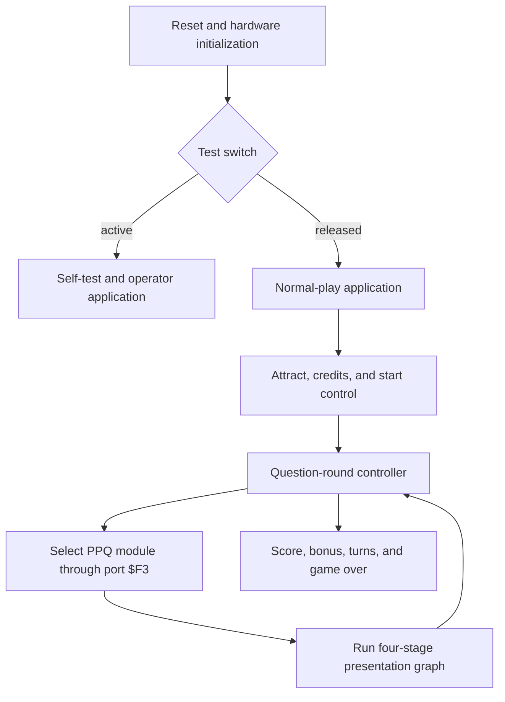
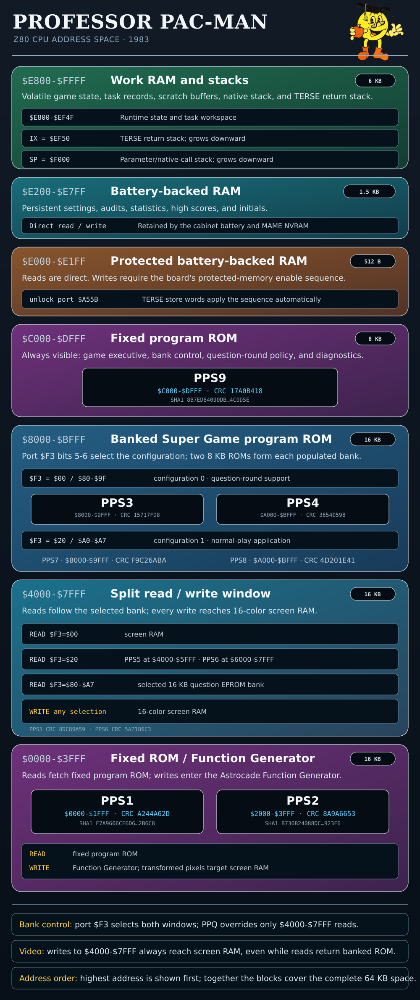
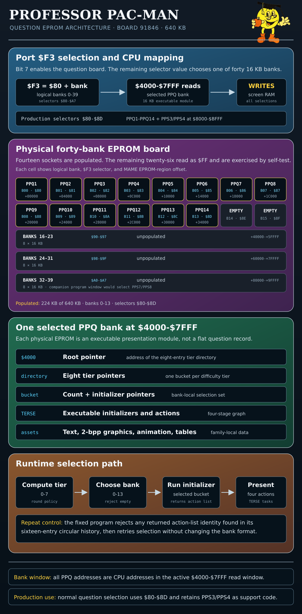
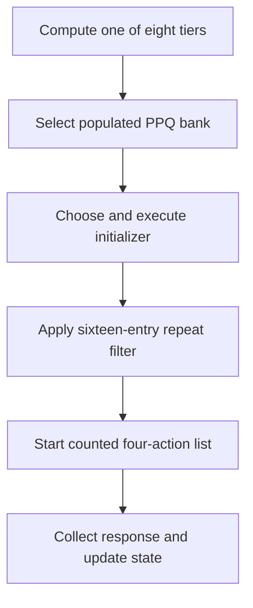

# Professor Pac-Man ROM disassembly


Professor Pac-Man is a 1983 animated quiz game developed by Dave Nutting
Associates and published by Bally Midway. Its dedicated Astrocade-family board
set combines a Z80, 16-color screen RAM, stereo Astrocade sound, banked program
ROM, battery-backed state, and a 640 KB EPROM board used for executable question
modules.

This project provides byte-exact source for every processor-visible program and
question ROM in the MAME `profpac` set. It preserves the physical ROM layout
while expressing the native Z80 kernel, TERSE runtime, threaded application,
question controller, and question-family action graphs as readable source.

## System architecture

| Component | Implementation |
| --- | --- |
| Processor | Z80 |
| Application language | Native Z80 and direct-threaded TERSE |
| Display | 16-color screen RAM with Astrocade drawing hardware and Pattern Mover |
| Sound | Two Astrocade custom I/O chips arranged as stereo channels |
| Program storage | Nine 8 KB `pps` ROMs in fixed and banked windows |
| Question storage | Fourteen populated 16 KB `ppq` EPROMs on a forty-bank board |
| Persistent state | Battery-backed RAM for settings, audits, statistics, and high scores |
| Bank control | Port `$F3` selects the program configuration and question EPROM |
| Programmable logic | Ten PLS153A fuse maps implementing board-level combinatorial glue |

The fixed ROMs contain the runtime, interrupt handlers, hardware services, game
executive, and bank-control code. Banked program ROMs provide additional TERSE
words, presentation code, graphics, and tables. Each question EPROM is an
executable presentation module containing TERSE initializers and actions
alongside its text, graphics, animation data, and parameters.



Cold start establishes the Z80 and TERSE stacks, initializes the hardware, and
selects program configuration 1. An active test switch enters the self-test
thread at `$6DD2`. Normal operation enters the fixed wrapper at `$DEBE`,
which selects configuration 1 and calls `MAIN_APPLICATION` at `$BE66`.

The normal application is a cooperative task graph. It coordinates attract
presentation, coin and credit handling, one- or two-player start selection,
question rounds, scoring, bonus questions, game over, high-score qualification,
and initials entry. The recovered configuration-1 graph is documented in
[game_progression.md](docs/game_progression.md); the complete question executive
is documented in [question_round.md](docs/question_round.md).

## Memory and ROM organization



| Address | Read mapping | Write mapping |
| --- | --- | --- |
| `$0000-$3FFF` | Fixed `pps1` and `pps2` | Function Generator |
| `$4000-$7FFF` | Screen RAM or selected `ppq` bank | 16-color screen RAM |
| `$8000-$BFFF` | Selected Super Game program ROM | — |
| `$C000-$DFFF` | Fixed `pps9` | — |
| `$E000-$E1FF` | Battery-backed, write-protected RAM | Battery-backed, write-protected RAM |
| `$E200-$E7FF` | Battery-backed RAM | Battery-backed RAM |
| `$E800-$FFFF` | Work RAM and stacks | Work RAM and stacks |

The six banked program ROMs form two populated configurations:

| Port `$F3` | `$4000-$7FFF` reads | `$8000-$9FFF` | `$A000-$BFFF` | Use |
| ---: | --- | --- | --- | --- |
| `$00` | Screen RAM | `pps3` | `pps4` | Question-round support |
| `$20` | `pps5` and `pps6` | `pps7` | `pps8` | Main application |
| `$80-$8D` | `ppq1`-`ppq14` | `pps3` | `pps4` | Question presentation |

The EPROM board provides forty 16 KB question-bank positions. The production
set populates banks 0 through 13; banks 14 through 39 are empty. The complete
memory, I/O, banking, video, and control map is maintained in
[hardware.md](docs/hardware.md).

Ten PLS153A devices provide combinatorial decode, timing, selection, and
control logic across four boards. Their complete 1,842-fuse maps, pin roles,
output enables, polarities, and Boolean equations are recovered in
[pls153a_equations.md](docs/pls153a_equations.md).

## TERSE execution model

Professor Pac-Man uses the DNA TERSE architecture: a compact native Z80
vocabulary executes direct-threaded application code. A colon definition begins
with `RST $08`. The handler saves the caller's threaded instruction pointer on
the `IX` return stack, loads the nested body into `BC`, and dispatches through
`TERSE_NEXT` at `$00F6`.

| Register | TERSE role |
| --- | --- |
| `BC` | Threaded instruction pointer |
| `IY` | Cached address of `TERSE_NEXT` |
| `IX` | Downward-growing threaded return stack, initialized to `$EF50` |
| `SP` | Parameter stack and balanced native-call stack, initialized to `$F000` |
| `HL`, `DE` | Primitive operands and parameter-stack values |

```z80
TERSE_NEXT:
        ld      a,(bc)
        inc     bc
        ld      l,a
        ld      a,(bc)
        inc     bc
        ld      h,a
        jp      (hl)
```

The resident native vocabulary at `$00FD-$05B7` supplies stack operations,
literals, arithmetic, comparisons, memory and port access, branches, loops,
frames, and protected-memory updates. Its implementations and register ABI
establish direct lineage with the TERSE engines in Sea Wolf II and Gorf.

Program ROM analysis identifies 357 colon definitions and 4,925 threaded cells.
The fixed and banked sources emit execution tokens symbolically, including
inline operands, branch targets, counted strings, and `CASES` tables.

- [terse.md](docs/terse.md) defines the runtime and execution model.
- [terse_vocabulary.md](docs/terse_vocabulary.md) catalogs resident words, stack
  effects, and cross-game correspondences.
- [threaded_code.md](docs/threaded_code.md) maps definitions, roots, bank contexts,
  and the decoded task graphs.
- [native_code.md](docs/native_code.md) maps the Z80 kernel, interrupt, hardware, and
  bank-switching paths.

## Executable question system

The question EPROMs are not a flat question database. Each `ppq` bank begins
with an eight-tier directory of initializer buckets. The fixed controller
selects a tier and populated bank, executes one initializer, filters the
returned action-list identity against recent history, and launches the accepted
presentation.





The fourteen banks contain 201 rooted directory references resolving to 130
bank-local initializers and 45 presentation families. Every family implements
the same four-stage contract:

1. Configure the scene.
2. Place the correct answer in a randomized slot.
3. Place one distractor in a different slot.
4. Fill the remaining slot and synchronize child actions.

The promoted family closure contains 401 bank-local TERSE definitions and
10,532 cells. The sources name every family, lifecycle action, internal thread,
initializer variant range, and tier bucket by function; address-derived PPQ
execution labels are rejected by the build. Family code selects prompts and
variants, constructs objects, starts animation tasks, yields cooperatively, and
signals completion. The fixed question-round controller owns answer timing,
correctness, score awards, player state, bonus scheduling, and the return to the
main application.

- [question_roms.md](docs/question_roms.md) specifies the bank directory, tier
  calculation, initializers, action lists, and repeat filter.
- [question_families.md](docs/question_families.md) inventories all 45 families,
  tier coverage, variants, prompts, and execution features.
- [question_presentation.md](docs/question_presentation.md) defines the shared scene,
  slot-allocation, object-state, and scheduler vocabulary.
- [graphics_animation.md](docs/graphics_animation.md) defines the native PPQ image
  records, pixel packing, rendering path, animation relationship, and decoded inventory.
- [question_family_ppq1.md](docs/question_family_ppq1.md) follows one family from
  initializer through rendering, answer placement, and completion.
- [question_round.md](docs/question_round.md) documents the complete fixed-ROM round
  state machine.

## Self-test and operator application

The test-switch path is a separate TERSE application. It implements circuitry,
RAM, ROM, continuous-operation, video, audio, switch, device, statistics, and
operator-settings menus. Its ROM tests cover the populated program and question
devices and distinguish empty question sockets. See
[self_test.md](docs/self_test.md) for the decoded hierarchy and execution tokens.

## Source organization

| Path | Contents |
| --- | --- |
| `src/pps1.asm`-`src/pps9.asm` | Nine independent 8 KB program-ROM assembly units |
| `src/ppq1.asm`-`src/ppq14.asm` | Fourteen independent 16 KB question-ROM assembly units |
| `src/profpac_common.include` | Shared hardware, RAM, TERSE, and application symbols |
| `src/profpac_question_common.include` | Shared question-bank mapping and format symbols |
| `tools/analyze_question_banks.py` | PPQ directory and tier validation |
| `tools/analyze_question_families.py` | Family identity, action-graph, and source validation |
| `tools/analyze_ppq_graphics.py` | Native 2-bpp PPQ image discovery and inline-pixel validation |
| `tools/analyze_question_round.py` | Fixed question-round closure validation |
| `tools/analyze_game_progression.py` | Configuration-1 application closure validation |
| `tools/decode_pls153a.py` | PLS153A fuse-map validation and Boolean-equation recovery |
| `docs/*.md` | Hardware, TERSE, question-system, game-flow, and self-test references |
| `build.sh` | Assembly, packaging, byte comparison, SHA-1, and structural verification |

Each physical ROM has an independent assembly unit because fixed and banked
devices occupy overlapping CPU address ranges. Native code is emitted as Z80
mnemonics. TERSE code is emitted as structured execution-token cells. Text,
graphics, descriptors, and other tables are emitted at their physical
addresses, preserving the original ROM bytes.

The ten `pls153a_*` archive members are PLS153A fuse maps for the CPU, EPROM,
game, and screen-RAM boards. They are packaged unchanged and are not Z80 code.

## Build

Requirements:

- zmac 1.3 at `tools/zmac`
- Python 3
- POSIX `cmp`, `sha1sum`, and `unzip`
- the canonical MAME `profpac.zip` at `roms/orig/profpac.zip`

Run:

```sh
chmod +x build.sh
./build.sh
```

The build performs the following checks:

1. Assemble `pps1`-`pps9` and `ppq1`-`ppq14` independently.
2. Print and compare every ROM's expected and actual SHA-1.
3. Compare every assembled ROM byte-for-byte with its baseline archive member.
4. Write verified ROM images under `roms/` and zmac listings under `build/`.
5. Construct the complete 33-member TorrentZip-compatible
   `roms/profpac.zip`, including the ten unchanged PLS153A dumps.
6. Compare the package byte-for-byte with the baseline and verify SHA-1
   `fc2c27f04a1a173ae79b5fb91c69ff85cc479c9c`.
7. Decode and validate all ten PLS153A fuse maps and their canonical SHA-1
   values.
8. Validate 193 reachable PPQ image records and their inline 2-bpp source rows.
9. Validate the promoted question-family, question-round, and main-progression
   TERSE structures.

The structural analyzers protect the readable disassembly as well as the ROM
bytes. They reject changes that preserve binary output while replacing decoded
definitions or action lists with undifferentiated data.

## Provenance and credits

The binary baseline is the MAME `profpac` set defined in
`src/mame/bally/astrocde.cpp`. Board names, switch assignments, memory
behavior, and diagnostic functions follow the Bally Midway Professor Pac-Man
operations manual and schematics.

Production credits identify Dave Nutting Associates as developer, Rick Frankel
as programmer, Mark Steven Pierce and Sue Forner for graphics, and Marc Canter
for sound and music. Johnny Lott and *RePlay* publisher Ed Adlum originated the
earlier Pac-Man-plus-quiz proposal; the released game is DNA's animated
multiple-choice implementation.
