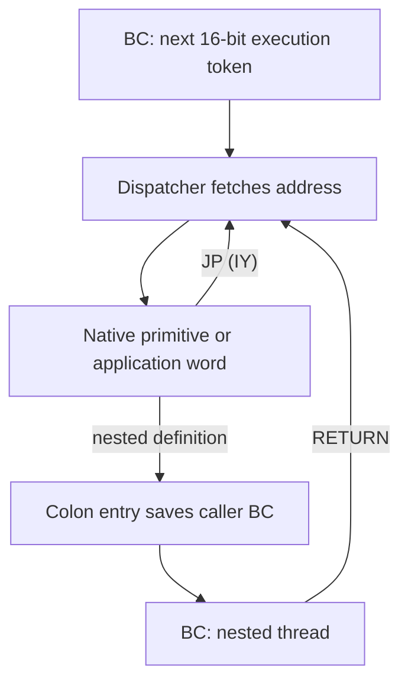
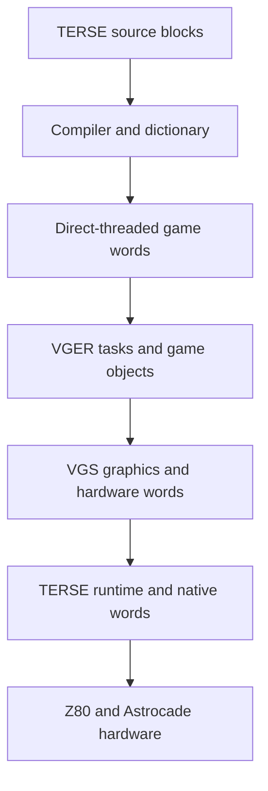
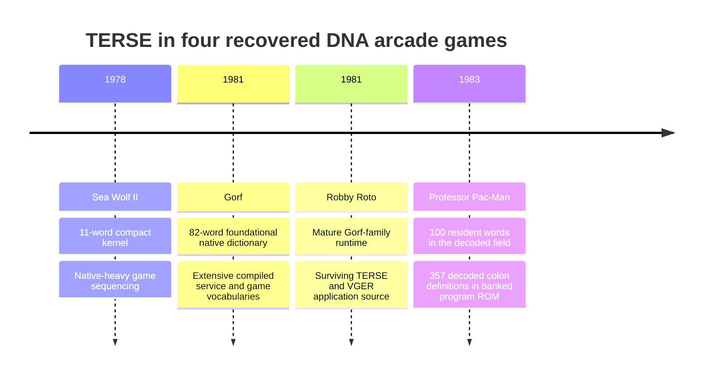

# TERSE on the Dave Nutting Astrocade Platform

## Architecture, evolution, and use in Sea Wolf II, Gorf, Robby Roto, and Professor Pac-Man

TERSE is the threaded Z80 programming system developed at Dave Nutting
Associates for its Astrocade-derived arcade hardware. It combines a small
native execution engine, a stack-oriented instruction set, compiled threaded
definitions, and direct access to game-specific native routines. The result is
neither a conventional interpreter nor a game written entirely in assembly. It
is a hybrid runtime in which compact threaded control code and optimized Z80
implementations execute through one calling convention.

Four recovered games show the system at distinct stages:

- **Sea Wolf II** (1978) contains a compact early engine used to sequence a
  mostly native game.
- **Gorf** (1981) contains a mature foundational dictionary and a large body of
  compiled game, graphics, sound, speech, and task-management words.
- **Robby Roto** (1981) applies the mature runtime to an unusually large,
  source-rich VGER game. Surviving TERSE block source exposes the language as
  its developers used it: colon definitions, native `CODE` and `SUBR` words,
  task declarations, arrays, variables, conditionals, and build screens.
- **Professor Pac-Man** (1983) retains the Gorf-family execution model and much
  of its dictionary while extending the runtime for a larger banked program and
  protected-memory environment.

The ROMs establish a clear technical lineage. TERSE began as a small,
purpose-built control engine, matured into a reusable game-development
platform, supported full VGER applications written largely in TERSE, and
remained useful as the foundation of a substantially different product five
years after Sea Wolf II.

## Contents

- [Evidence and terminology](#evidence-and-terminology)
- [Execution architecture](#execution-architecture)
- [Reading compiled TERSE](#reading-compiled-terse)
- [From language to game system](#from-language-to-game-system)
- [Sea Wolf II: the compact engine](#sea-wolf-ii-the-compact-engine)
- [Gorf: the mature runtime](#gorf-the-mature-runtime)
- [Robby Roto: TERSE as the working language](#robby-roto-terse-as-the-working-language)
- [Professor Pac-Man: reuse and specialization](#professor-pac-man-reuse-and-specialization)
- [Comparative evolution](#comparative-evolution)
- [Implementation lineage](#implementation-lineage)
- [Technical evaluation](#technical-evaluation)
- [Conclusions](#conclusions)
- [Research baseline](#research-baseline)

## Evidence and terminology

This analysis separates four kinds of evidence:

| Evidence class | Use |
| --- | --- |
| Byte-exact ROM source | Execution paths, register roles, word implementations, inline formats, and resident vocabulary |
| Surviving Robby Roto TERSE block source | Developer notation, source organization, compiler forms, task definitions, and VGER application structure |
| Contemporary TERSE glossary | Canonical word names and language semantics |
| Historical and technical documentation | Authorship, development context, VGS/VGER terminology, and intended programming model |

The principal technical evidence is the reconstructed ROM source for all four
games, strengthened in Robby Roto by surviving TERSE block source. Historical
documents explain intent, but they do not override executable behavior. A
glossary entry establishes what a word means; the ROM establishes whether that
word is present and how that particular game implements it. The Robby Roto
blocks establish how developers composed those words before compilation.

The September 21, 1981 TERSE Standard Glossary contains 317 verbs spanning the
runtime, compiler, editor, debugger, disk tools, and development environment. It
is not a list of words embedded in every shipped game. Each release carries the
runtime subset required by its compiled program, together with custom words for
its hardware and gameplay.

Firsthand accounts agree that Alan McNeil created TERSE at Dave Nutting
Associates but differ on the expansion of its name. Rickey Spiece recalled
**Terse Efficient Recursive Stack Engine**; Tony Miller recalled **Terse
Efficient Reentrant Stack Engine**. McNeil's own résumé supplies the more useful
technical definition: “a Z80 direct threaded code version of FORTH.” This
document therefore uses the name TERSE without choosing between the two
remembered expansions. The recovered engines independently confirm McNeil's
description.

Spiece also supplied the practical warning that frames this reverse-engineering
work: after the native engine is disassembled, the remaining program requires a
TERSE disassembler. Professor Pac-Man demonstrates exactly why. Its execution
tokens resemble little-endian addresses and its inline operands resemble more
addresses; only word-aware control-flow decoding separates code, operands, and
data reliably.

### Words, verbs, and execution tokens

TERSE documentation uses *word* and *verb* for callable language operations.
This document uses:

- **primitive** for a word implemented directly in native Z80;
- **colon definition** for a word compiled as a sequence of execution tokens;
- **execution token** for the 16-bit native address stored in a direct-threaded
  instruction stream;
- **application word** for a game-specific native routine callable through the
  TERSE dispatcher;
- **helper** for native code called by a primitive but not itself present in
  threaded code.

## Execution architecture

### Direct-threaded execution

A TERSE thread is principally a sequence of little-endian Z80 addresses. The
dispatcher reads the next address through `BC`, advances `BC` by two bytes, and
jumps directly to that address. A native word performs its operation and jumps
through `IY` to resume dispatch.



The dispatcher is small because no opcode decoder is required. The token is
already the native destination. On Gorf and Professor Pac-Man the central loop
has the same seven-instruction form:

```z80
DSPATCH:
        ld      a,(bc)
        inc     bc
        ld      l,a
        ld      a,(bc)
        inc     bc
        ld      h,a
        jp      (hl)
```

Sea Wolf II uses the same operation at `$0043`. Professor Pac-Man places it at
`$00F6`. Gorf names it `DSPATCH`. Compact words in all four systems terminate
with the two bytes `FD E9`, the Z80 encoding of `JP (IY)`.

### Register allocation

The engine dedicates most of the Z80's primary execution state to the language:

| Register | TERSE role |
| --- | --- |
| `BC` | Threaded instruction pointer |
| `SP` | Parameter stack and balanced native call stack |
| `IX` | Return/control stack for nested definitions and loop frames |
| `IY` | Native continuation, normally the dispatcher |
| `HL`, `DE` | Primitive operands, addresses, arithmetic workspace, and dispatcher target |

This allocation is visible in all four games. It is one of the strongest
lineage markers because the same register contract governs the dispatcher,
colon entry, return word, primitives, application words, and interrupt
preservation rules.

### Colon definitions

A colon definition is a reusable thread. Entry saves the caller's `BC` on the
IX control stack, obtains the nested thread address from the native call return,
and resumes through `IY`. `RETURN` restores the saved `BC` and removes the
control-stack cell.

Performance-sensitive rendering, collision, sound, input, and hardware code can
remain native. Higher-level sequencing can use two-byte tokens. A native
routine becomes a TERSE word by obeying the shared register and stack contract,
not by passing through a separate foreign-function interface.

### Inline operands

Some words consume bytes or words immediately following their execution token.
Common examples include:

| Word | Inline data | Result |
| --- | --- | --- |
| `LIT` | 16-bit value | Push value |
| `LITbyte` | 8-bit value | Push zero-extended value |
| `BARRAY` | 16-bit base address | Add byte index and push effective address |
| `ARRAY` | 16-bit base address | Add doubled word index and push effective address |
| `BRANCH` | 16-bit thread address | Replace `BC` |
| `0BRANCH` | 16-bit thread address | Replace or skip according to flag |
| `A"` | Counted string | Push string address and advance `BC` past it |

Inline formats preserve threaded-code density by avoiding a separate literal
pool or instruction decoder.

## Reading compiled TERSE

TERSE is easiest to understand by following one source definition through its
compiled form and then through the dispatcher. The examples below use recovered
game code rather than invented pseudocode.

### A colon definition becomes an address thread

Gorf and Robby Roto both compile `MAX` as ordinary high-level TERSE. In source
notation, its behavior is equivalent to:

```forth
: MAX  2DUP < IF SWAP THEN DROP ;
```

Robby Roto stores the compiled definition at `$03F2`. In normalized symbolic
form, the ROM body is:

```z80
MAX:
        rst     $08             ; enter nested TERSE definition
        dw      _2DUP
        dw      _LESS
        dw      _0BRANCH
        dw      max_keep_first
        dw      _SWAP
max_keep_first:
        dw      _DROP
        dw      _RETURN
```

The first byte is executable Z80: `RST $08` enters the colon runtime. Everything
after it is a thread of execution tokens and inline branch data. `BC` advances
through the tokens; `_0BRANCH` consumes the following destination; `_RETURN`
restores the caller's `BC` from the IX stack.

This definition also shows why TERSE cannot be disassembled correctly by
treating the entire ROM as Z80 instructions. Most of the body is an address
language interpreted by the resident words.

### Stack effects make dense source readable

The useful unit of explanation is the word plus its stack effect:

| Word | Stack effect | Action |
| --- | --- | --- |
| `2DUP` | `( a b -- a b a b )` | Duplicate the top pair |
| `<` | `( a b -- flag )` | Compare signed values |
| `0BRANCH` | `( flag -- )` | Consume an inline target and branch when false |
| `SWAP` | `( a b -- b a )` | Exchange the top pair |
| `DROP` | `( a -- )` | Remove the top value |

Reading the `MAX` body with those effects makes the data flow explicit: retain
one copy of each input, compare the duplicate pair, arrange the retained pair so
the greater value is on top, then discard the other value.

### Native code is part of the same vocabulary

Robby Roto source freely mixes colon definitions with `CODE` words and `SUBR`
helpers. This compact application word from block 260 performs a native nearby
object test and resumes threaded execution with `NEXT`:

```forth
CODE MTC?  H POP,  EXX, D POP, H POP, E H MOV, EXX,
           X PUSHX, NEARBYLIST CALL,
           0 H LXI, 0=, IF, H INX, THEN,
           X POPX, H PUSH, NEXT
```

Its TERSE interface is `( column row list -- flag )`. The implementation uses
Z80 registers and a native helper, then pushes the Boolean result in the same
form expected by compiled callers. No separate interpreter/native bridge is
needed.

### Inline data belongs to the consuming word

Professor Pac-Man's initial thread demonstrates word and byte literals,
conditional branches, and calls into both native and compiled vocabulary:

```z80
INITIAL_THREAD:
        dw      VALIDATE_BATTERY_RAM
        dw      _LIT
        dw      $E1DA
        dw      ALIAS_BZERO
        dw      TERSE_COLON_47C5
        dw      _LIT
        dw      $E1D9
        dw      _Bat
        dw      _1
        dw      _equal
        dw      _0BRANCH
        dw      first_initialization
```

`$E1DA` and `$E1D9` are not execution tokens; each belongs to the preceding
`LIT`. Likewise, `first_initialization` belongs to `_0BRANCH`. Correct recovery
therefore requires the decoder to know each word's inline format.

### `CASES` compiles a bounded dispatch table

Professor Pac-Man uses a positional selector whose inline data begins with the
address immediately after the table:

```z80
        dw      _CASES
        dw      cases_end
        dw      case_0
        dw      case_1
        dw      case_2
        dw      case_3
        dw      case_4
cases_end:
```

`CASES` removes an index from the parameter stack, doubles it, bounds-checks the
computed table position against `cases_end`, and jumps to the selected execution
token. An out-of-range index resumes at `cases_end`. This is a dense compiled
switch statement built from an application-specific primitive and inline
addresses.

## From language to game system

The shipped dispatcher is only the bottom of TERSE. The surviving manuals
describe an interactive development system with a compiler, dictionary,
numbered source blocks, an editor, disk tools, a Z80 assembler, and a debugger.
The games then add reusable video and scheduling vocabularies above that base.



The layers are vocabulary boundaries, not protected software compartments. A
game definition can call a foundational primitive, a VGS drawing word, a VGER
task service, or a game-specific native word. All return through the same TERSE
execution contract.

### The development environment

The *TERSE Standard Glossary* defines both the runtime language and the tools
used to build it. `:` creates a colon definition; `CODE` creates a word from
assembler statements; `NEXT` terminates that native definition. `VARIABLE`,
`CONSTANT`, `TABLE`, `VOCABULARY`, `LOAD`, and `BLOCK` organize data and source.
The editor treats a block as sixteen 64-character lines.

The debugger operates at TERSE-word granularity. It can single-step the inner
interpreter, show the parameter and return stacks, set execution-token
breakpoints, identify a word from its code address, and uncompile a definition.
That tool model explains the source style: developers reasoned in words and
stack effects even when a word's body was native Z80.

The separate Z80 assembler vocabulary preserves the same postfix style seen in
Robby Roto source:

```forth
CODE DOIT  H POP, PCHL, NEXT
```

`DOIT` removes an address from the parameter stack and transfers control to it.
The assembler is not a separate source language pasted into TERSE; it is another
vocabulary selected while defining a native word.

### VGS turns hardware into words

The recovered *Video Game System Glossary* defines stack interfaces for common
arcade operations:

| Area | Representative VGS words |
| --- | --- |
| Coordinates and motion | `VECTOR`, `LIMIT` |
| Text and numbers | `POST`, `#POST`, `CLOCK` |
| Drawing | `1DOT`, `DRAW`, `BOX`, `ELLIPSE`, `SCROLL`, `SHAPE` |
| Display hardware | `COLOR`, `FLOOD`, `VERTICAL`, `HORIZONTAL` |
| Game utility | `RANDOM`, `SUM` |

Each word exposes a compact stack contract while its native body handles screen
addresses, Magic RAM modes, expanded pixels, intercept detection, color ports,
or timing. This is the bridge from a general stack language to the Astrocade as
a game machine.

### VGER adds scheduled behavior

VGER builds task and object orchestration above TERSE and VGS. Robby Roto's
surviving `;TASK:` definitions provide direct source evidence; Gorf's ROM shows
the same mature style through its task, animation, speech, sound, and mission
vocabularies. Sea Wolf II predates this broad recovered layer. Professor Pac-Man
uses TERSE extensively, but its application remains unclassified as VGER until
its object and scheduling structures establish that relationship.

## Sea Wolf II: the compact engine

Sea Wolf II is the earliest recovered commercial TERSE implementation in this
four-game study. Its complete program occupies 8 KB. The runtime contains 11
thread-dispatchable kernel words, 21 native application words, and six complete
threaded programs. Alan McNeil's résumé identifies the game as “written mostly
in TERSE.” The ROM shows the hybrid form of that claim: short TERSE control
programs organize a larger vocabulary of native game operations.

### Resident kernel

| Address | Word | Function |
| ---: | --- | --- |
| `$0039` | `RETURN` | Restore the caller's threaded IP |
| `$004A` | Inline byte fetch | Read through an inline 16-bit address |
| `$0052` | `B@` | Fetch a byte through a stacked address |
| `$0059` | `B!` | Store a byte |
| `$005E` | `BEGIN` | Save a loop origin on the IX control stack |
| `$006E` | `UNTIL` | Repeat while the flag is zero |
| `$0081` | `TRUE` | Push `$FFFF` |
| `$0087` | `LIT` | Push an inline 16-bit value |
| `$0090` | Byte complement | Complement the low byte |
| `$0097` | `0BRANCH` | Conditional inline branch |
| `$00A8` | `BRANCH` | Unconditional inline branch |

The kernel is deliberately narrow. It provides nested calls, literals, byte
state, Boolean control, and loops—the minimum useful vocabulary for sequencing
native game operations.

### How Sea Wolf II uses TERSE

Sea Wolf II does not express every algorithm as stack code. Rendering,
diagnostics, target management, scoring, collision handling, and device I/O are
predominantly native Z80 routines. TERSE organizes those routines into compact
foreground programs:

- initial machine and game-state sequencing;
- a nested initialization thread;
- the attract/control loop;
- localized GAME OVER presentation threads.

The control thread illustrates the intended division of labor. Native words
poll controls, manipulate counters, draw text, and update state. TERSE
`BEGIN`/`UNTIL`, literals, byte stores, and nested returns define the control
structure. The maximum observed parameter-stack depth is two 16-bit cells.

This is not an incomplete general-purpose runtime. It is a complete,
game-sized execution vocabulary selected for one 8 KB program.

### Engineering character

Sea Wolf II demonstrates the original value proposition:

- two-byte calls compress foreground sequencing;
- native routines retain direct hardware performance;
- the IX stack permits nested threads without disturbing the parameter stack;
- a tiny dispatcher unifies native and threaded control;
- only words used by the shipped program consume ROM.

Jamie (Jay) Fenton's March 1979 Addin listing shows the next step already
underway. Its assembly source identifies TERSE macros and TERSE `CIRCLE`,
`SHOW`, and `BOX`
commands, evidence that reusable graphics services were growing around the
engine before the mature Gorf and Robby Roto systems.

## Gorf: the mature runtime

By Gorf, TERSE had expanded from a compact sequencing kernel into the
foundation of a reusable arcade software system. Gorf's eight 4 KB program ROMs
contain a recovered foundational dictionary of 82 native words, followed by a
large body of compiled and native game-service vocabulary.

### Foundational dictionary

The native core covers the major facilities expected from a Forth-family
runtime:

| Category | Representative words |
| --- | --- |
| Thread control | `RETURN`, `LIT`, `LITbyte`, `DLIT`, `BRANCH`, `0BRANCH`, `LEAVE` |
| Stack operations | `DUP`, `2DUP`, `DROP`, `SWAP`, `2SWAP`, `OVER`, `ROT`, `PICK`, `2DROP`, `R>`, `>R`, `SP@` |
| Memory | `@`, `B@`, `!`, `B!`, `ZERO`, `BMOVE`, `+!`, `1+!`, `1-!` |
| Arithmetic | `+`, `-`, `MINUS`, `1+`, `1-`, `2+`, `2-`, `2*`, `2/`, `*`, `/MOD` |
| Logic | `COM`, `AND`, `OR`, `XOR`, `NOT` |
| Comparison | `=`, `<>`, signed and unsigned relational words, zero comparisons |
| Loops | `DO`, `LOOP`, `+LOOP`, `I`, `J`, `K`, `I+`, `J+`, `K+` |
| Hardware I/O | `INP`, `OUTP` |
| Data access | `ARRAY`, `BARRAY`, `A"` |

The 82-word count describes the recovered foundational native field, not the
entire Gorf runtime. Gorf adds compiled words such as `MAX`, `MIN`, `MOVE`,
`MOD`, `/`, `NAND`, and `NOR`, plus game-specific native and threaded
vocabularies.

### From language core to game platform

Gorf uses TERSE as the common execution substrate for substantially more than
foreground initialization. Its compiled definitions connect:

- graphics and object services;
- task and animation control;
- input and cabinet state;
- score and audit handling;
- Astrocade sound generation;
- Votrax speech scheduling;
- mission-specific game logic.

The source shows two complementary forms of reuse. Foundational primitives are
shared by every compiled definition. Higher-level service words encapsulate
recurring arcade operations and become a game-oriented vocabulary.

### Why the mature form matters

Gorf demonstrates that TERSE was not only a ROM-saving notation. The mature
system provides stable interfaces between game logic and specialized native
subsystems. The language boundary is also the module boundary: any routine that
preserves the TERSE contract can participate in threaded execution.

The result supports a large game composed of distinct missions, concurrent
object behavior, synthesized sound, and queued speech without requiring every
feature to adopt the same implementation technique.

## Robby Roto: TERSE as the working language

Robby Roto supplies a different class of evidence from the other games. Its ROM
contains the mature Gorf-family runtime, while surviving development blocks
preserve a substantial portion of the original TERSE application source. The
source is incomplete as an archive—its recovered index begins with loader
material and then resumes at application block 44—but 193 distinct
colon-definition names are syntactically recoverable, together with extensive
`CODE`, `SUBR`, data, variable, array, conditional-compilation, and task
material.

The blocks turn architectural inference into direct observation. They show a
commercial game being developed in TERSE rather than merely a ROM that happens
to contain a threaded engine.

### Mature runtime continuity

Robby Roto uses the same core contract seen in Gorf:

- `RST $08` enters a colon definition;
- `BC` is the threaded instruction pointer;
- `SP` is the parameter stack;
- `IX` holds return and loop frames;
- `IY` points to the seven-instruction dispatcher;
- native words terminate with `NEXT`, encoded as `JP (IY)`;
- inline `LIT`, `LITbyte`, array bases, strings, and branches are consumed
  directly from the thread.

The foundational implementation is not merely similar in concept. Robby Roto
contains the same detailed primitive shapes and compiled service forms visible
in Gorf, including `LITbyte`, `BARRAY`, `ARRAY`, `MAX`, `MIN`, `MOD`, `/`, `OF`,
and the shared stack, comparison, loop, memory, and I/O vocabulary. Addresses
differ where each game's reset and hardware initialization change the layout;
the execution ABI and implementation family remain stable.

### Source blocks and the development model

TERSE source was organized in numbered 1 KB screens or blocks. The Robby Roto
index moves through player and monster behavior, maze generation, pathfinding,
rendering, scoring, vector mathematics, animation, collision, game control, and
diagnostics. These are not assembly modules. They are groups of words that
extend the game vocabulary. The language is the project structure.

### TERSE and VGER in one source

Robby Roto directly identifies a VGER layer. Block 152 is headed
`EDIBLE VGER` and dated August 24, 1981. Later blocks define numerous words with
`;TASK:` and coordinate them using `WAIT`, `DIVG`, `SLEEP`, timers, vector
records, and animation services.

For example, the recovered player task begins:

```forth
: R:B ;TASK:
  Src Snm REVV H:R
  BEGIN DIVG
    P.S B@ PLEM CASE
    DVECT-OFF
    ...
```

This is not a single foreground thread calling a handful of assembly routines.
It is a task body compiled in TERSE and hosted by the VGER scheduling and vector
services. Native `SUBR` and `CODE` routines remain available wherever collision,
coordinate, drawing, or search work benefits from Z80 implementation.

Robby Roto therefore occupies an important position in the lineage: Gorf shows
the mature runtime in a polished multi-mission product; Robby Roto exposes the
same generation of technology as a source-level game-development environment.

### Build and product configuration

The source also preserves development behavior absent from a ROM-only study. A
disk loader restores dictionary pointers, loads separate address ranges, and
boots the image. Conditional forms such as
`XC? IFTRUE ... OTHERWISE ... IFEND` select product or hardware variants.
Stable wrapper names hide the selected memory implementation:

```forth
: WPB!     B! ;
: WP!      ! ;
: 1+WPB!   1+B! ;
: 1-WPB!   1-B! ;
: WPZERO   ZERO ;
: WPBONE   BONE ;
: WPBZERO  BZERO ;
```

The caller sees one memory-update vocabulary while the selected implementation
enforces the board's storage rules. Professor Pac-Man later applies the same
idea with native protected-memory words and bank-local linkage entries.

Internal dates from August 1981 through February 1982 show that the surviving
blocks represent multiple working snapshots, not one immutable source release.

## Professor Pac-Man: reuse and specialization

Professor Pac-Man appeared five years after Sea Wolf II and two years after
Gorf. Its hardware and content model differ sharply from both. The program ROM
set contains nine 8 KB devices, while fourteen additional 16 KB EPROMs contain
the populated question and presentation database.

Despite that product change, the fixed `pps1` ROM begins with the same TERSE
family architecture:

- colon entry at `$0008`;
- `BC` threaded instruction pointer;
- `SP` parameter stack;
- `IX` return/control stack;
- `IY` dispatcher continuation;
- direct 16-bit execution tokens;
- `JP (IY)` word termination;
- the Gorf-family primitive order beginning with `RETURN` at `$00FD`.

### Resident vocabulary

The decoded field through `$05A3` contains 100 dispatchable TERSE words. It
retains the Gorf ordering where words are shared, removes words not required by
the game, supplies native implementations for several words compiled in Gorf,
and adds frame and memory-update facilities used by Professor Pac-Man.

| Region | Role |
| ---: | --- |
| `$00FD-$040E` | Foundational stack, arithmetic, comparison, loop, branch, string, and I/O words |
| `$0410-$0455` | `OF`, native `MAX`, and bounded `CASES` dispatch |
| `$0456-$04DB` | Local-variable and parameter stack frames |
| `$04DC-$05B7` | Protected-aware byte/word stores and block movement |

Representative direct correspondences include:

| Professor Pac-Man | Word | Gorf relationship |
| ---: | --- | --- |
| `$00FD` | `RETURN` | Same role and native sequence |
| `$0109` | `LIT` | Same inline 16-bit literal primitive |
| `$0112` | `LITbyte` | Same custom byte-literal optimization |
| `$011A` | `BARRAY` | Same inline base-address operation |
| `$0125` | `ARRAY` | Same doubled-index operation |
| `$0136` | `DUP` | Same stack operation |
| `$015A` | `+` | Same 16-bit arithmetic operation |
| `$01CF` | `=` | Same Boolean convention and comparison structure |
| `$026F` | `DO` | Same six-byte IX loop frame |
| `$0397` | `+LOOP` | Same signed loop-crossing logic |
| `$03E2` | `BRANCH` | Same inline branch representation |
| `$0405` | `A"` | Same inline counted-string operation |

### Native promotion and selective omission

Professor Pac-Man does not copy the Gorf dictionary mechanically. It omits
unused foundational words such as `DLIT`, return-stack transfer words, several
unsigned comparisons, and outer-loop index helpers. It promotes several useful
operations to native code:

- `MAX` is a native comparison rather than a compiled colon definition;
- `MOD` and `/` are native wrappers around the common division helper;
- `OF` and `CASES` are native branch-selection operations;
- frame accessors are specialized for the exact local and parameter counts used
  by compiled definitions.

This is evidence of source-level reuse followed by application-specific
linking and optimization, not an invariant ROM image shared among games.

The recovered *Terse Verbs* screens clarify the frame extension. A screen headed
`DOIT AND STACK FRAME VERBS` defines an indirect execution word and a family of
`PARAM`-based accessors. Professor Pac-Man's frame setup and parameter/local
words follow that documented TERSE design pattern, although the exact semantic
name of each resident entry still depends on its callers. Its `_EXECUTE` word is
an extreme native optimization of the same idea: a one-byte `RET` transfers to
the execution address already on `SP`.

### Protected-memory integration

Professor Pac-Man's ordinary store vocabulary incorporates the board's
protected-memory behavior. The words `B!`, `!`, `BZERO`, `BONE`, `ZERO`, `ONE`,
increment, decrement, add, subtract, and `MOVE` route writes through native
helpers. Addresses in the protected aperture are unlocked through output port
`$5B`; ordinary work RAM uses direct stores.

Threaded code therefore invokes the same memory verbs regardless of the target
address. Hardware policy is localized in the native implementation rather than
propagated through every compiled caller.

One bank configuration also exposes a compact linkage vocabulary whose entries
jump to the canonical fixed-ROM store words. Banked threads retain stable local
tokens while sharing one protected-memory implementation.

### Fit for the quiz-game architecture

Professor Pac-Man uses TERSE as the control substrate around a much larger data
system. Native and threaded program code select banks through port `$F3`, fetch
question and presentation content, operate expanded video hardware, manage
settings and retained statistics, and drive comprehensive diagnostics.

The vocabulary's survival in this environment shows the value of the ABI. The
hardware, content volume, and game genre changed; the compiled control model
remained useful.

### Measured threaded application

Control-flow decoding now identifies 357 physical colon definitions containing
4,925 validated threaded cells across the nine program ROMs. This changes the
classification of Professor Pac-Man from “a game containing a TERSE kernel” to
a large TERSE application with a substantial native support layer.

Its call graph is necessarily bank-aware. Two hardware configurations expose
different physical program ROMs at the same CPU addresses while three ROMs
remain fixed. The normal and service roots select the required configuration
before entering their application threads. A correct disassembly must therefore
track both the execution token and the active bank map.

Thread traversal also proves native word entries invisible to ordinary Z80
`CALL`/`JP` discovery. Examples include banked fetch and compare services,
pattern and text renderers, question/program checksum words, byte fill,
mismatch counting, cold restart, and `_EXECUTE`. These entries are public
through the TERSE dictionary even when native control-flow traversal never
reaches them.

## Comparative evolution



| Property | Sea Wolf II | Gorf | Robby Roto | Professor Pac-Man |
| --- | --- | --- | --- | --- |
| Release generation | 1978 | 1981 | 1981-era source snapshots | 1983 |
| Program image represented here | 8 KB | 32 KB | 64 KB disassembly plus recovered blocks | 72 KB plus question EPROMs |
| Recovered evidence | 11-word kernel; six threads | 82-word foundational native field plus compiled vocabulary | Gorf-family core; 193 syntactically recoverable colon names | 100 resident words; 357 decoded colon definitions and 4,925 cells |
| Thread format | 16-bit direct addresses | 16-bit direct addresses | 16-bit direct addresses | 16-bit direct addresses |
| Register ABI | `BC` / `SP` / `IX` / `IY` | `BC` / `SP` / `IX` / `IY` | `BC` / `SP` / `IX` / `IY` | `BC` / `SP` / `IX` / `IY` |
| Primary use | Compact foreground sequencing | General game and service runtime | Source-level VGER game implementation | Banked quiz and presentation system |
| Application balance | Small kernel, many native words | Large shared dictionary and compiled vocabulary | Extensive TERSE tasks with native accelerators | Large core plus banked and hardware-specific services |

The counts are not a language-complexity ranking and are not directly
interchangeable. Sea Wolf II's 11 counts kernel words; Gorf's 82 counts a
foundational native field; Robby Roto's 193 counts distinct colon names visible
in an incomplete source recovery; Professor Pac-Man's 357 counts physically
unique decoded colon bodies. Each number describes a different evidence set.

## Implementation lineage

### Structural evidence

The lineage rests on multiple independent implementation features:

1. The same register ABI assigns `BC`, `SP`, `IX`, and `IY` to the same roles.
2. The dispatcher reads a little-endian native address and jumps through `HL`.
3. Colon entry saves `BC` as two bytes on a downward-growing IX stack.
4. `RETURN` restores `BC` from that stack.
5. Native words resume with `JP (IY)`.
6. Inline literals and branches advance or replace `BC` directly.
7. Gorf, Robby Roto, and Professor Pac-Man share vocabulary order and detailed
   instruction sequences across the foundational dictionary.
8. The mature games contain the nonstandard `LITbyte` optimization; Gorf and
   Professor Pac-Man also preserve specialized counted-string operations.
9. Robby Roto source names compiler forms that correspond directly to the
   recovered ROM structures.
10. Professor Pac-Man preserves the ABI across two bank configurations and uses
    a linkage table to retain stable word interfaces.

Any single feature could occur in another threaded interpreter. Their combined
presence, including custom optimizations and word ordering, establishes shared
TERSE source lineage.

### Evolution, not binary inheritance

The ROMs also show deliberate divergence:

- Sea Wolf II has control words absent from the later foundational ordering and
  a dedicated `$FFFF` true constant.
- Gorf carries general stack, loop, arithmetic, and hardware words not linked
  into Professor Pac-Man.
- Robby Roto builds an extensive VGER task application from the mature runtime
  and adds game-specific native coordinate, maze, and object services.
- Professor Pac-Man adds native frame specializations and address-sensitive
  protected-memory operations.
- Game-specific native words dominate different functional areas in each
  release.

TERSE should therefore be understood as a maintained software system with a
stable execution contract and selectable vocabularies—not as one fixed engine
copied byte-for-byte into every game.

## Technical evaluation

| Strength | Engineering value | Cost |
| --- | --- | --- |
| Two-byte execution tokens | Compact control paths and reusable definitions | A token fetch and indirect jump for every word |
| Uniform native-word ABI | Rendering, collision, sound, banking, and other expensive work remain native | Native and interrupt code must preserve TERSE register state |
| Separate parameter and control stacks | Values remain distinct from nested-call and loop frames | `SP` is also the Z80 call stack and every native stack effect must balance |
| Selectable vocabularies | Games share the runtime while linking only the services they need | Addresses and resident subsets are not universal across games |
| Inline operands | Literals, branches, strings, and tables remain dense | Static decoding must know the operand format of every token |

Hardware abstraction remains deliberately thin. `INP`, `OUTP`, VGS drawing
words, protected-memory stores, and game services hide repeated board sequences,
but their native implementations retain exact control of the Z80 and devices.

TERSE is well matched to the Astrocade arcade platform. It spends a small amount
of execution time to reduce repeated control code, formalize native interfaces,
and support a reusable software vocabulary. Its hybrid design avoids the main
weakness of a pure interpreter: expensive work remains native. It also avoids
the main weakness of an all-assembly codebase: every higher-level control path
does not need to reproduce the same low-level sequences.

Sea Wolf II proves the model at minimum scale. Gorf demonstrates its use as a
full game-development platform. Robby Roto shows that platform in source-level
use and directly connects TERSE to VGER tasks. Professor Pac-Man demonstrates
longevity and adaptability across a different hardware expansion and game
genre.

## Conclusions

The recovered ROMs and source establish a coherent TERSE development history:

1. **Sea Wolf II** uses a small direct-threaded engine to sequence native game
   operations inside an 8 KB program.
2. **Gorf** expands the same execution model into a broad foundational
   dictionary and a layered game-service environment.
3. **Robby Roto** uses that mature environment as a source-level VGER game
   system, combining compiled tasks with native application words and helpers.
4. **Professor Pac-Man** preserves the ABI, primitive lineage, custom
   optimizations, and dictionary organization while tailoring the linked
   vocabulary to banked program ROM, protected memory, and a large question
   database.

The central achievement is not the dispatcher alone. It is the durable
contract between compact threaded definitions and native Z80 code. That
contract allowed Dave Nutting Associates to grow TERSE from a tiny game engine
into reusable infrastructure, build VGER games in a vocabulary-oriented source
environment, and then apply it to products with markedly different
requirements.

## Research baseline

This edition is a baseline for continued reverse engineering. The following
areas will strengthen later revisions:

- semantic naming and stack-effect recovery for Professor Pac-Man's 357 decoded
  colon definitions;
- call-graph classification of Professor Pac-Man initialization, service,
  operator, self-test, presentation, and question-management words;
- exact shared-word counts based on normalized Gorf and Professor Pac-Man
  instruction bodies;
- byte-level normalization of the Gorf and Robby Roto foundational fields;
- reconciliation of surviving Robby Roto block revisions with the shipped ROM;
- identification of any VGS or VGER-derived Professor Pac-Man services;
- reconstruction of the original source/compiler linkage model;
- comparison with Wizard of Wor, Extra Bases, and other recovered TERSE-family
  programs.

### Source set

- Sea Wolf II byte-exact disassembly and technical README
- Gorf byte-exact disassembly
- Robby Roto byte-exact disassembly
- Robby Roto recovered TERSE source blocks and screen index
- Robby Roto commercial video-game hardware equates (`CVGLIB.H`)
- Professor Pac-Man `pps1`-`pps9` byte-exact sources
- Professor Pac-Man TERSE vocabulary map
- *TERSE Standard Glossary*, September 21, 1981
- *Terse Verbs* source screens
- *Video Game System Glossary*
- *Interactive Debugger*
- *Edit Verbs*, revision 4
- *Z-80 Assembler*
- Jamie (Jay) Fenton's March 1979 Addin listing
- Rickey Spiece discussion compiled by Richard C. Degler
- Alan McNeil résumé excerpts compiled in *Programmers of the Astrocade
  Built-in Programs*
- categorized TERSE verb index
- *TERSE Naming Rules & Conventions*
- preliminary architecture and TERSE/VGS/VGER technical studies
- MAME `astrocde.cpp` hardware definitions and ROM maps
