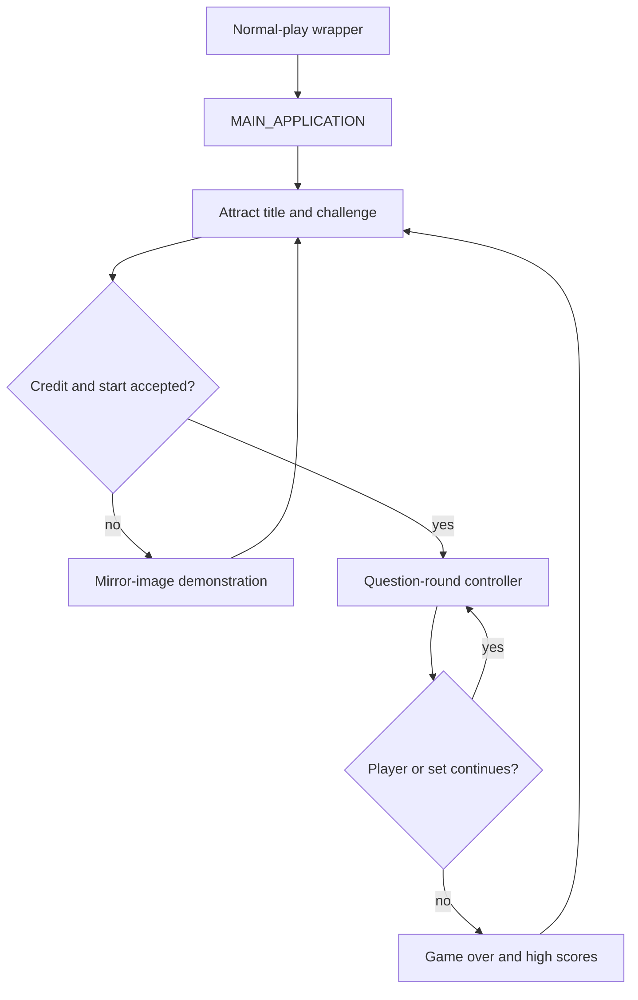

# Main game progression

Professor Pac-Man's normal application is a cooperative TERSE task graph in
program-bank configuration 1. The fixed wrapper at `$DEBD` selects that bank
and calls `MAIN_APPLICATION` at `$BE66`. The application validates retained
RAM, initializes the display and scheduler, and enters `MAIN_PROGRESSION_TASK`
at `$BCDB`. The question controller temporarily selects configuration 0 and
returns through the one-action list at `$DECB`.

The complete configuration-1 progression closure contains 60 colon
definitions, 1,960 TERSE cells, and 11 counted action lists in `pps8` and
`pps9`. `tools/analyze_game_progression.py` validates the closure, list
membership, semantic roots, and structured source on every build.

## Application cycle



`MAIN_PROGRESSION_TASK` starts three persistent control tasks: start/turn
control, attract sound, and coin/credit control. While no start is accepted it
alternates the challenge prompt with a complete mirror-image demonstration.
The credit/start footer remains a separate child action, allowing coin and
start state to interrupt the attract presentation without embedding input
polling in the drawing tasks.

## Credits and start selection

`START_GAME_CONTROL_TASK` is the gate between attract mode and play. It waits
until `CREDIT_COUNT_ADDR` is positive or `FREE_PLAY_FLAG_ADDR` is set, reads
port `$10`, complements the active-low inputs, rotates start bits 4 and 5 into
bits 0 and 1, and rejects values outside the one-player/two-player selection.
Coin play limits the selection to the available credit count; free play
accepts either start button. The accepted selection initializes:

- the game/round mode and current-player selector;
- the player-one and player-two four-byte scores;
- question, response, and completion flags;
- the display/task environment used by `QUESTION_ROUND_CONTROLLER`.

The one-player path maintains player-one state only. The two-player path keeps
separate score and round-count fields and changes `CURRENT_PLAYER_INDEX_ADDR`
at the fixed question-controller boundary. Both paths invoke the same question
executive through `QUESTION_ROUND_VECTOR` at `$C01C`.

## Attract presentation

| Action list | Work |
| --- | --- |
| `MAIN_CONTROL_ACTIONS` | Start/turn control, attract sound, and coin/credit control |
| `ATTRACT_CHALLENGE_PROMPT_ACTIONS` | Free-play or insert-coin challenge screen |
| `ATTRACT_DEMO_QUESTION_ACTIONS` | “Which is the mirror image?” demonstration |
| `CREDIT_START_PROMPT_ACTIONS` | Credit counter and one-player/two-player prompt |

The demonstration is executable game machinery, not a prerecorded sequence.
`ATTRACT_MIRROR_DEMO_ACTIONS` creates the scene, correct image, and distractor
objects as three scheduler tasks. Its prompt and graphics are resident in
`pps8`; no PPQ bank is selected. `ATTRACT_TITLE_AND_SCORE_TASK` supplies the
title/high-score portion of the cycle, while `ATTRACT_CHALLENGE_PROMPT_TASK`
selects the coin or free-play message from retained operator state.

## Question and score progression

An accepted start initializes both four-byte player scores to zero and derives
the initial difficulty from the operator setting. `QUESTION_ROUND_CONTROLLER`
then owns the repeated question cycle: tier selection, answer timing,
correctness, score arithmetic, per-player round counts, turn selection, and
bonus scheduling. Configuration 1 remains the application shell around that
controller.

Normal question selection advances through eight six-question tiers. A bonus
question uses the upper four directory tiers and doubles the visible scoring
path. Correct responses add the response-time-dependent award; wrong or
expired responses follow the fruit-loss path. The controller updates the
active player's score and returns through `MAIN_PROGRESSION_ACTIONS` when the
set or player state requires an application-level transition. The exact
question-cycle branches and state fields are documented in
[question_round.md](question_round.md).

## Game over and high scores

`GAME_OVER_HIGH_SCORE_TASK` selects the applicable player score, renders the
game-over/result presentation, compares the score with the retained table, and
runs initials entry for every qualifying player. In two-player play the same
path evaluates the two scores independently.

The retained table is split into parallel arrays:

| Address | Shape | Contents |
| ---: | --- | --- |
| `$E150-$E177` | 10 × 4 bytes | Double-cell score records |
| `$E178-$E195` | 10 × 3 bytes | Three-character initials records |

`COMPARE_UNSIGNED_SCORE` performs the unsigned double-cell comparison.
`INSERT_HIGH_SCORE_ENTRY` scans the ten records from highest to lowest, shifts
lower records and their initials together, inserts the qualifying score, and
fills the new initials slot with spaces. Scores below the tenth entry leave the
table unchanged. `INIT_DEFAULT_HIGH_SCORE_TABLE` installs the factory scores
and initials when retained RAM is invalid.

The initials editor uses the three right/left answer buttons selected for the
qualifying player. `READ_INITIALS_ENTRY_BUTTONS` returns edge-qualified button
bits; the editor moves forward or backward through the character set and
commits the current character. `LOAD_HIGH_SCORE_INITIALS` and
`STORE_HIGH_SCORE_INITIALS` move exactly three bytes between the selected table
slot and the working buffer. Completion returns to the attract cycle.

## Configuration-1 call graph

| Root | Address | Principal descendants |
| --- | ---: | --- |
| `MAIN_APPLICATION` | `$BE66` | retained-RAM setup, display setup, resume/new-game selection, main progression |
| `MAIN_PROGRESSION_TASK` | `$BCDB` | control list, challenge prompt, demo question, game-over list, credit/start footer |
| `START_GAME_CONTROL_TASK` | `$D4DF` | start-button decode, credit charge, 1P/2P state, score initialization, question-vector call |
| `ATTRACT_DEMO_QUESTION_TASK` | `$B4FC` | title action plus three-task mirror demonstration |
| `ATTRACT_CHALLENGE_PROMPT_TASK` | `$B6C9` | challenge header, coin message, free-play message |
| `GAME_OVER_HIGH_SCORE_TASK` | `$DB1B` | score selection, qualification, sorted insertion, initials editor |

## Verification

Run the focused graph check with:

```sh
python3 tools/analyze_game_progression.py --check-sources roms/profpac.zip
```

`build.sh` runs this check after all 23 ROMs have matched their member SHA-1s
and the rebuilt 33-member MAME archive has matched the canonical archive byte
for byte and by SHA-1.
