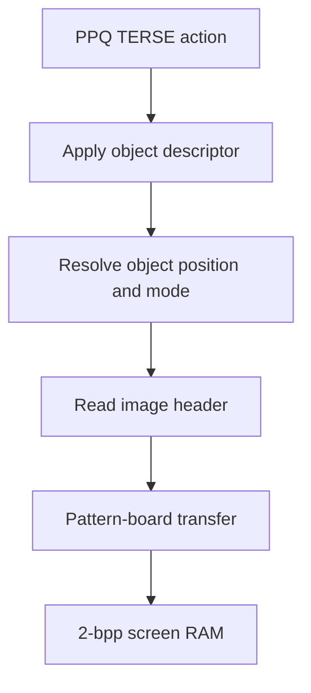

# Professor Pac-Man graphics and animation data

Professor Pac-Man stores question artwork as native Astrocade two-bit
pixels. It does not use Sea Wolf II's one-bit masks plus Function Generator
expansion. Each PPQ image has a four-byte object-relative header followed by
row-major packed pixels:

| Offset | Field | Meaning |
| ---: | --- | --- |
| `+0` | X reference | Horizontal reference used by the object-position transform. |
| `+1` | Y reference | Vertical reference used by the object-position transform. |
| `+2` | Width | Source bytes per row; four two-bit pixels per byte. |
| `+3` | Height | Number of rows. |
| `+4` | Pixels | `width × height` bytes, top-to-bottom and left-to-right. |

Within each byte, pixels are ordered bits 7-6, 5-4, 3-2, and 1-0.
The source comments render palette indices as compact `.123` strings.
Those digits are stored pixel values, not fixed colors: Astrocade color
registers and object modes determine their displayed palette.

## Rendering path

`APPLY_AND_DRAW_OBJECT` combines descriptor application and the immediate
draw. Variant-indexed families select an image address from a word table
before making the same call. Animated families use an extended object
descriptor: its high flag bit selects an animation payload, and the task
update path changes the current image pointer and object coordinates before
the renderer runs. The bitmap record itself remains the same native 2-bpp
format whether selected directly, through a variant table, or by animation.

## Object and animation descriptors

The word at `$1CB4`, named `APPLY_OBJECT_DESCRIPTOR`, distinguishes a direct
image record from an extended object descriptor by bit 7 of byte `+2`.

| Offset | Direct image | Extended descriptor |
| ---: | --- | --- |
| `+0` | X reference | Auxiliary byte copied into object animation state when flag bit 1 is set |
| `+1` | Y reference | Not consumed by the descriptor installer |
| `+2` | Source-byte width | Low nibble becomes object control flags; bit 7 selects the extended form |
| `+3...` | Height and packed pixels | Variable animation/object payload retained in the task object |

For an extended descriptor, flag bit 0 resets the associated animation state;
flag bit 1 installs byte `+0` and forces the initial state to one; flag bit 3
selects the two-byte setup form. The installer retains a pointer into the
remaining payload. Per-tick object code consumes that state, updates position
and rendering controls, and publishes the image pointer later used by the same
native drawing path.

This separation is why the PPQ ROMs do not contain a single universal
“animation frame” structure. An animation is the composition of a TERSE task,
an extended object descriptor, motion/control data, and one or more ordinary
2-bpp images. The mirror-flock family demonstrates all four layers: three
child actions install separate motion descriptors, the scene owns a
three-entry motion table, and the outer answer actions draw either the primary
or mirrored 52×42 bird image. Other families use task-vector words to switch
update behavior while retaining the same image-record ABI.

## Decoded inventory

| PPQ | Images | Direct | Table/atlas selected | Packed bytes |
| --- | ---: | ---: | ---: | ---: |
| `ppq1` | 13 | 13 | 0 | 6954 |
| `ppq2` | 18 | 5 | 13 | 4088 |
| `ppq3` | 10 | 8 | 2 | 3101 |
| `ppq4` | 7 | 7 | 0 | 1012 |
| `ppq5` | 16 | 11 | 5 | 3285 |
| `ppq6` | 19 | 0 | 19 | 3486 |
| `ppq7` | 16 | 2 | 14 | 3665 |
| `ppq8` | 8 | 2 | 6 | 1926 |
| `ppq9` | 24 | 21 | 3 | 3477 |
| `ppq10` | 16 | 4 | 12 | 2893 |
| `ppq11` | 12 | 0 | 12 | 1837 |
| `ppq12` | 7 | 0 | 7 | 3431 |
| `ppq13` | 14 | 5 | 9 | 6814 |
| `ppq14` | 13 | 3 | 10 | 4190 |
| **Total** | **193** | **81** | **112** | **50159** |

Every listed record is selected by a reachable question-family graph,
a variant image table used at a draw site, or PPQ6's pointer-addressed
hand/figure atlas. The ranges are non-overlapping and remain inside the
active `$4000-$7FFF` bank window.

Representative source records include the 52×42 bird image and its
mirror variant, telephone and dial components, maze pieces, die faces,
vehicles, table-setting objects, and mirrored dog/deer figures. Inline
rows make the exact stored image readable without assigning palette
colors that the record does not own.

Run `python3 tools/analyze_ppq_graphics.py roms/profpac.zip --check-sources`
to validate the record geometry, range separation, and inline source
annotations.
