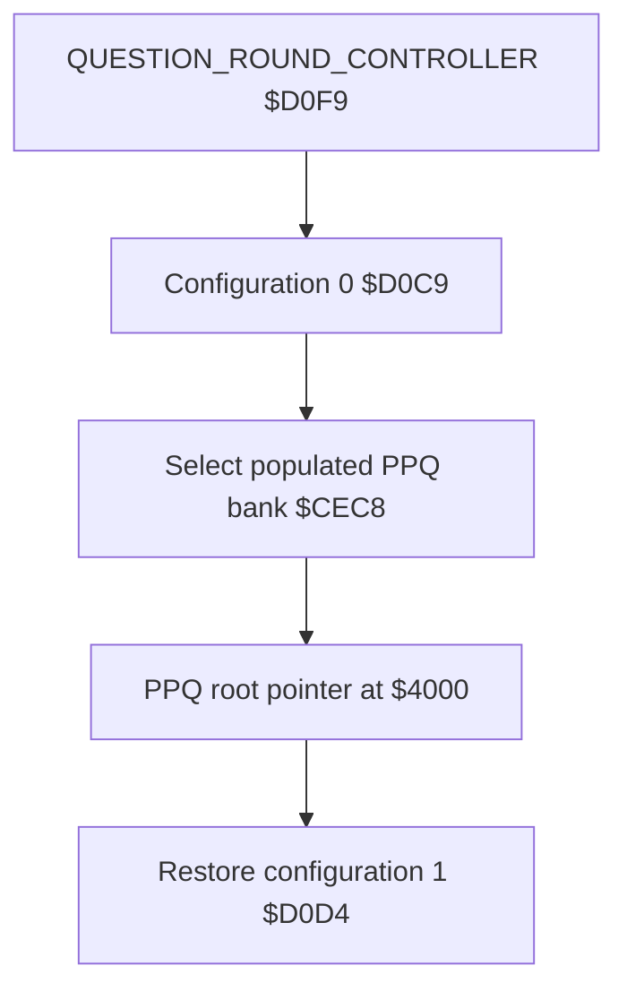

# Professor Pac-Man hardware notes

This map follows the supplied MAME driver and the Bally Midway operations
manual. It describes the emulated production configuration, not a generic
Astrocade board.

## Board set

| Board | Function |
| --- | --- |
| 91465 | 16 Color CPU Card |
| 91466 | Screen RAM Board |
| 91467 | Super Game Memory |
| 91469 | Professor Pac-Man Game Board |
| 91488 | Pattern Mover |
| 91846 | 640K EPROM Board |

## Z80 memory map

| Address | Access | Function |
| --- | --- | --- |
| `$0000-$3FFF` | R / special W | Fixed `pps1`-`pps2`; writes feed the Function Generator |
| `$4000-$7FFF` | R/W | Banked read window; writes target 16-color screen RAM |
| `$8000-$BFFF` | R | Banked Super Game Memory window |
| `$C000-$DFFF` | R | Fixed `pps9` |
| `$E000-$E1FF` | R/W | Battery-backed, write-protected RAM |
| `$E200-$E7FF` | R/W | Battery-backed RAM |
| `$E800-$FFFF` | R/W | Work RAM and Z80 stacks |

Cold start establishes `IX=$EF50` for the TERSE return stack and `SP=$F000`
for native Z80 calls. The protected RAM write-enable sequence is issued through
the Astrocade output decoding at port address `$A55B`.

## Bank control

Port `$F3` controls both banked read windows. Every write first applies bits
5-6 to the Super Game Memory selector. When bit 7 is set, the 640K EPROM board
then overrides only the `$4000-$7FFF` read window. The `$8000-$BFFF` selection
continues to follow bits 5-6.

| Selector | `$4000-$7FFF` reads | `$8000-$9FFF` | `$A000-$BFFF` |
| ---: | --- | --- | --- |
| `$00` | 16-color screen RAM | `pps3` | `pps4` |
| `$20` | `pps5` and `pps6` | `pps7` | `pps8` |
| `$40` | Empty Super Game configuration 2 | Empty | Empty |
| `$60` | Empty Super Game configuration 3 | Empty | Empty |
| `$80-$9F` | Question banks 0-31 | `pps3` | `pps4` |
| `$A0-$A7` | Question banks 32-39 | `pps7` | `pps8` |

Low bits 0-4 are ignored for Super Game selection. They become the question
bank number when bit 7 is set. Thus a populated production question selection
simultaneously exposes one `ppq` image at `$4000-$7FFF`, `pps3` at
`$8000-$9FFF`, and `pps4` at `$A000-$BFFF`.

The EPROM-board selector is `$80 + bank`. The board provides forty 16 KB
banks, but the production set populates fourteen:

| Logical banks | Selector | Physical contents |
| ---: | ---: | --- |
| 0-13 | `$80-$8D` | `ppq1`-`ppq14` |
| 14-39 | `$8E-$A7` | Unpopulated sockets, read as `$FF` |

| Selector | Bank | ROM | Selector | Bank | ROM |
| ---: | ---: | --- | ---: | ---: | --- |
| `$80` | 0 | `ppq1` | `$87` | 7 | `ppq8` |
| `$81` | 1 | `ppq2` | `$88` | 8 | `ppq9` |
| `$82` | 2 | `ppq3` | `$89` | 9 | `ppq10` |
| `$83` | 3 | `ppq4` | `$8A` | 10 | `ppq11` |
| `$84` | 4 | `ppq5` | `$8B` | 11 | `ppq12` |
| `$85` | 5 | `ppq6` | `$8C` | 12 | `ppq13` |
| `$86` | 6 | `ppq7` | `$8D` | 13 | `ppq14` |

Selections above `$A7` map the open bank in MAME. A hardware jumper can move
the EPROM selection base from `$80` to `$A8`; the production program and ROM
set use `$80`.

### Bank-switch callers

All native `OUT ($F3),A` instructions reside in `pps1`. The game-level direct
writes are fixed-ROM TERSE definitions in `pps9`.

| Entry | Selection | Role |
| --- | --- | --- |
| Cold start `$0074` | `$20` | Establish configuration 1 for normal application startup |
| `CHECKSUM_SELECTED_ROM` `$00A5` | Caller-supplied | Check an 8 KB Super Game segment or 16 KB question bank |
| `FETCH_BANKED_WORD` `$0846` | Caller-supplied | Fetch one word through the lower bank window, then restore `$20` |
| `FETCH_BANK_ZERO_BYTE` `$0855` | `$00` | Fetch one byte with configuration 0, then restore `$20` |
| `COMPARE_SCREEN_AND_BANK` `$085F` | `$00` | Compare screen/bank paths, then restore `$20` |
| `READ_SCREEN_WINDOW_BYTE` `$08A8` | `$00` | Read the screen window, then restore `$20` |
| `SELECT_RANDOM_POPULATED_QUESTION_BANK` `$CEC8` | `$80 + random bank` | Select a populated question bank and leave it active |
| `SELECT_SUPER_GAME_CONFIGURATION_0` `$D0C9` | `$00` | Enter the question-round program context |
| `SELECT_SUPER_GAME_CONFIGURATION_1` `$D0D4` | `$20` | Restore the normal-play program context |
| `NORMAL_PLAY_THREAD` `$DEBE` | `$20` | Establish configuration 1 before entering the main application |

`QUESTION_ROUND_CONTROLLER` is the sole caller of both configuration words.
It selects configuration 0 at `$D0FC`, chooses a nonrepeating question through
`SELECT_NONREPEATING_QUESTION`, and restores configuration 1 at `$D355` before
returning. The selected question bank remains active during the intervening
presentation path. The PPQ directory, tier, initializer, and action-list
formats are specified in [question_roms.md](question_roms.md). Gameplay uses
the `$1F` byte at `$DF1D` as the random-bank
bound and retries candidates whose first directory word is `$FFFF`. The ROM
diagnostic independently covers all forty physical bank positions.

The ROM diagnostics use two independent fixed tables. The seventeen entries at
`$DF00` pair an `$F3` configuration byte with the one's complement of an 8 KB
Super Game ROM byte sum. The fourteen words at `$DF38` hold the corresponding
16 KB byte-sum complements for `ppq1`-`ppq14`. The checker adds the computed
sum, table word, and one; a valid device produces zero.
`QUESTION_EPROM_BANK_EMPTY` probes the first word of a candidate bank;
`VERIFY_QUESTION_EPROM_BANK` checks populated banks and reports empty sockets
separately.

## I/O map

| Ports | Function |
| --- | --- |
| `$00-$0F` | Astrocade video registers and primary I/O decoding |
| `$10-$1F` | Primary Astrocade inputs / sound registers |
| `$19` | Expand register |
| `$50-$58` | Secondary Astrocade sound registers |
| `$78-$7E` | Pattern Mover registers |
| `$BF` | Screen page select |
| `$C0-$C5` | 16-color screen RAM controls |
| `$C3` read | 16-color intercept result |
| `$F3` | ROM bank select |

The primary Astrocade output strobes also write two six-bit latches on the game
board. One controls two coin counters and two LEDs; the other controls the left
and right A/B/C button lamps.

## Controls and switches

The cabinet supplies two coin switches, service/test, tilt, one- and two-player
start switches, and three answer buttons for each player. All are active low.

The eight-position option switch exposes:

| Switch | Meaning |
| --- | --- |
| 1 | Upright/mini or cocktail cabinet |
| 2 | Full reset on power-up |
| 3 | Lock up on continuous-test error |
| 4 | Audio response to test results |
| 5 | Display ROM tests for 32K devices or 8K/16K devices |
| 6-8 | Unused |

Switch 5 changes only the organization shown by the ROM test; it does not alter
normal game execution.

## Video and sound

The screen RAM design expands the Astrocade family to a 16-color display. MAME
models 4096 palette entries, screen-page selection, six screen-RAM control
registers, and a dedicated intercept read. Writes in `$4000-$7FFF` always reach
screen RAM even when reads from that range are serving banked ROM.

Two Astrocade custom I/O chips provide stereo audio. The self-test generates
three simultaneous tones in each channel and expects equal volume after the
cabinet potentiometers are adjusted.
