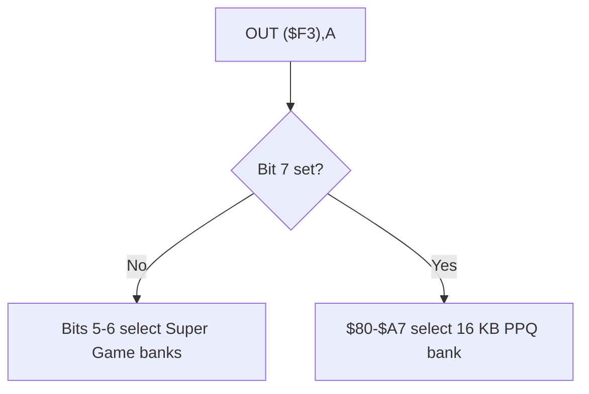

# Professor Pac-Man hardware notes

This map follows the supplied MAME driver and the Bally Midway operations
manual. It describes the emulated production configuration, not a generic
Astrocade board.

## Board set

| Board | Function |
| --- | --- |
| 91465 | 16 Color CPU Card |
| 91466 | Screen RAM Board |
| 91467 | Super Game Memory |
| 91469 | Professor Pac-Man Game Board |
| 91488 | Pattern Mover |
| 91846 | 640K EPROM Board |

## Z80 memory map

| Address | Access | Function |
| --- | --- | --- |
| `$0000-$3FFF` | R / special W | Fixed `pps1`-`pps2`; writes feed the Function Generator |
| `$4000-$7FFF` | R/W | Banked read window; writes target 16-color screen RAM |
| `$8000-$BFFF` | R | Banked Super Game Memory window |
| `$C000-$DFFF` | R | Fixed `pps9` |
| `$E000-$E1FF` | R/W | Battery-backed, write-protected RAM |
| `$E200-$E7FF` | R/W | Battery-backed RAM |
| `$E800-$FFFF` | R/W | Work RAM and Z80 stacks |

Cold start establishes `IX=$EF50` for the TERSE return stack and `SP=$F000`
for native Z80 calls. The protected RAM write-enable sequence is issued through
the Astrocade output decoding at port address `$A55B`.

## Bank control

Port `$F3` drives both banked windows.

- Bits 5-6 select one of four Super Game Memory configurations used by the
  `$4000-$7FFF` and `$8000-$BFFF` windows.
- Values `$80-$A7` select one of forty 16 KB EPROM-board banks at
  `$4000-$7FFF`.
- Out-of-range EPROM selections map the open/unpopulated bank used by MAME.

MAME notes that a hardware jumper could move the EPROM selection base from
`$80` to `$A8`. The production ROM drives the `$80` convention.

## I/O map

| Ports | Function |
| --- | --- |
| `$00-$0F` | Astrocade video registers and primary I/O decoding |
| `$10-$1F` | Primary Astrocade inputs / sound registers |
| `$19` | Expand register |
| `$50-$58` | Secondary Astrocade sound registers |
| `$78-$7E` | Pattern Mover registers |
| `$BF` | Screen page select |
| `$C0-$C5` | 16-color screen RAM controls |
| `$C3` read | 16-color intercept result |
| `$F3` | ROM bank select |

The primary Astrocade output strobes also write two six-bit latches on the game
board. One controls two coin counters and two LEDs; the other controls the left
and right A/B/C button lamps.

## Controls and switches

The cabinet supplies two coin switches, service/test, tilt, one- and two-player
start switches, and three answer buttons for each player. All are active low.

The eight-position option switch exposes:

| Switch | Meaning |
| --- | --- |
| 1 | Upright/mini or cocktail cabinet |
| 2 | Full reset on power-up |
| 3 | Lock up on continuous-test error |
| 4 | Audio response to test results |
| 5 | Display ROM tests for 32K devices or 8K/16K devices |
| 6-8 | Unused |

Switch 5 changes only the organization shown by the ROM test; it does not alter
normal game execution.

## Video and sound

The screen RAM design expands the Astrocade family to a 16-color display. MAME
models 4096 palette entries, screen-page selection, six screen-RAM control
registers, and a dedicated intercept read. Writes in `$4000-$7FFF` always reach
screen RAM even when reads from that range are serving banked ROM.

Two Astrocade custom I/O chips provide stereo audio. The self-test generates
three simultaneous tones in each channel and expects equal volume after the
cabinet potentiometers are adjusted.

