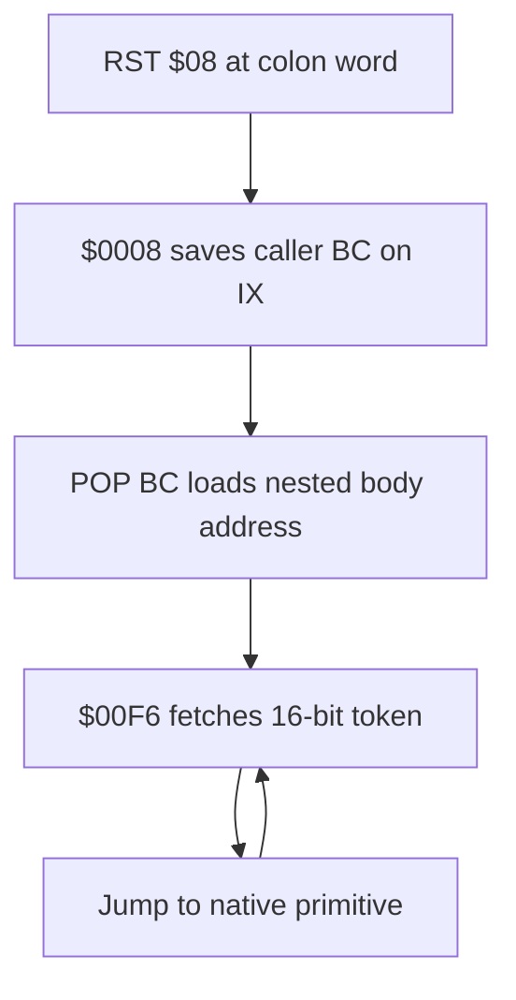

# TERSE runtime notes

Professor Pac-Man contains a direct-threaded TERSE engine. The identification
rests on the executable kernel in `pps1`, its byte-level correspondence with
the mature Gorf engine, the recovered threaded application, and the documented
TERSE vocabulary. It does not depend on a generic claim that the game was
written in FORTH.

## Runtime entry points

| Address | Name | Contract |
| --- | --- | --- |
| `$0008` | `TERSE_COLON_ENTRY` | Consume the return address left by `RST $08`, save the caller's threaded instruction pointer, and enter the nested body |
| `$00F2` | `TERSE_INIT` | Cache the address of `TERSE_NEXT` in `IY` |
| `$00F6` | `TERSE_NEXT` | Fetch the next 16-bit execution token and jump to its native implementation |

## Register model

| Register | Confirmed role |
| --- | --- |
| `BC` | Threaded instruction pointer |
| `IY` | Cached address of `TERSE_NEXT` (`$00F6`) |
| `IX` | Downward-growing threaded return stack, initialized to `$EF50` |
| `SP` | TERSE parameter stack and balanced native Z80 call stack, initialized to `$F000` |
| `HL`, `DE` | Primitive operands and conventional parameter-stack values |

The separation between `IX` and `SP` is decisive. Colon entry saves `BC` on the
`IX` stack, obtains the nested body address from the return address placed on
`SP` by `RST $08`, and dispatches through `IY`. Native helpers may use `CALL`
and `PUSH`, but must restore the shared hardware stack before threaded
execution resumes.



## Kernel bytes

Initialization falls through into the seven-byte `TERSE_NEXT` loop:

```z80
TERSE_INIT:
        ld      iy,TERSE_NEXT
TERSE_NEXT:
        ld      a,(bc)
        inc     bc
        ld      l,a
        ld      a,(bc)
        inc     bc
        ld      h,a
        jp      (hl)
```

`TERSE_COLON_ENTRY` is thirteen bytes:

```z80
TERSE_COLON_ENTRY:
        dec     ix
        ld      (ix),b
        dec     ix
        ld      (ix),c
        pop     bc
        jp      (iy)
```

## Native primitive field

The dense native-code run beginning at `$00FD` has the expected Forth kernel
shape: literal fetches from `(BC)`, stack shuffles, arithmetic, comparisons,
memory fetch/store, port access, branches, loop control, and transitions back
through `JP (IY)`. It is therefore treated as a primitive vocabulary, not as
ordinary game control flow.

The resident vocabulary at `$00FD-$05B7` is decoded and named. It contains the
foundational stack, arithmetic, comparison, loop, branch, frame, port-I/O, and
memory-update words used by compiled game definitions. The complete address
and stack-effect reference is maintained in
[terse_vocabulary.md](terse_vocabulary.md).

The foundational ordering and native implementations establish a direct code
lineage with Gorf. Sea Wolf II carries the earlier compact form of the same
dispatcher and register ABI.

## Naming discipline

Canonical TERSE names are used where the 1981 glossary, surviving source, or an
implementation-identical Gorf word establishes the spelling and semantics.
Behavioral names are used for game-specific or otherwise unproven entries.
`TERSE_COLON_ENTRY` is deliberately descriptive: the standard glossary word
`ENTER` creates a dictionary entry and is not the `$0008` runtime.

The shared include defines `XT_*` constants for the fixed resident vocabulary.
Banked assembly units use those constants in threaded `DW` cells while `pps1`
retains the native implementation labels. This makes the execution-token field
symbolic without linking the nine overlapping physical ROM units together.

## Threaded application coverage

The program ROMs contain 357 structurally validated colon definitions and
4,925 decoded execution-token cells. Threads are represented as `RST $08`
entries, `DW` execution tokens and word operands, `DB` byte operands and
counted strings, and labeled branch/`CASES` targets. The complete coverage,
initial and service roots, bank contexts, and thread-proven native entries are
documented in [threaded_code.md](threaded_code.md).

## Architecture identification

Professor Pac-Man is a TERSE-family game. Its direct-threaded dispatcher,
separate native and threaded stacks, colon-word entry path, and native primitive
field implement the DNA threaded architecture used by the game application.
