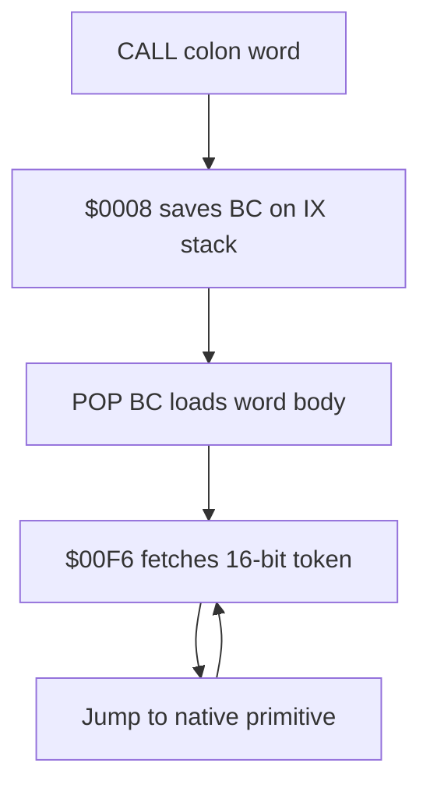

# TERSE runtime notes

Professor Pac-Man contains a direct-threaded, Forth-derived execution engine.
The identification is based on executable structure in `pps1`, not on the
generic historical description that the game was written in FORTH.

## Runtime entry points

| Address | Name | Contract |
| --- | --- | --- |
| `$0008` | `TERSE_COLON_ENTRY` | Save the caller's threaded instruction pointer and enter a colon definition |
| `$00F2` | `TERSE_INIT` | Cache the address of `TERSE_NEXT` in `IY` |
| `$00F6` | `TERSE_NEXT` | Fetch the next 16-bit execution token and jump to its native implementation |

## Register model

| Register | Confirmed role |
| --- | --- |
| `BC` | Threaded instruction pointer |
| `IY` | Cached address of `TERSE_NEXT` (`$00F6`) |
| `IX` | Downward-growing threaded return stack, initialized to `$EF50` |
| `SP` | Native Z80 call/data stack, initialized to `$F000` |
| `HL`, `DE` | Primitive operands and conventional parameter-stack values |

The separation between `IX` and `SP` is decisive. Colon entry saves `BC` on the
`IX` stack, obtains the new threaded address from the native call return on
`SP`, and dispatches through `IY`.



## Kernel bytes

Initialization falls through into the seven-byte `TERSE_NEXT` loop:

```z80
TERSE_INIT:
        ld      iy,TERSE_NEXT
TERSE_NEXT:
        ld      a,(bc)
        inc     bc
        ld      l,a
        ld      a,(bc)
        inc     bc
        ld      h,a
        jp      (hl)
```

`TERSE_COLON_ENTRY` is thirteen bytes:

```z80
TERSE_COLON_ENTRY:
        dec     ix
        ld      (ix),b
        dec     ix
        ld      (ix),c
        pop     bc
        jp      (iy)
```

## Native primitive field

The dense native-code run beginning at `$00FD` has the expected Forth kernel
shape: literal fetches from `(BC)`, stack shuffles, arithmetic, comparisons,
memory fetch/store, port access, branches, loop control, and transitions back
through `JP (IY)`. It is therefore treated as a primitive vocabulary, not as
ordinary game control flow.

Names will be promoted only after each stack effect is proven and, where
possible, matched against the established Gorf TERSE vocabulary. The next word
table should record:

| Field | Meaning |
| --- | --- |
| Execution token | Native entry address stored in a thread |
| Name | Proven or cross-matched TERSE word |
| Stack effect | Inputs and outputs on the parameter stack |
| Clobbers | Z80 registers and flags modified |
| Evidence | Native behavior, caller use, or Gorf correspondence |

## Architecture identification

Professor Pac-Man is a TERSE-family game. Its direct-threaded dispatcher,
separate native and threaded stacks, colon-word entry path, and native primitive
field implement the DNA threaded architecture used by the game application.
