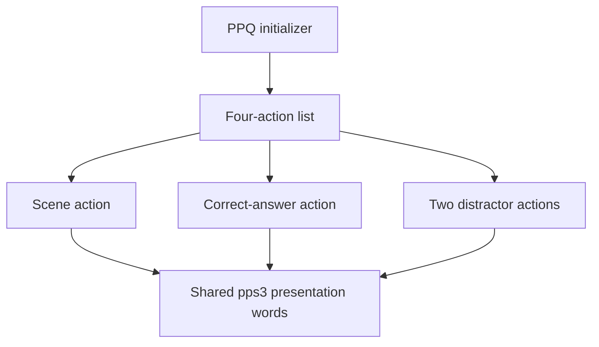

# Professor Pac-Man question-presentation engine

Professor Pac-Man separates question content from presentation machinery. The
fourteen `ppq` ROMs supply executable TERSE initializers, action threads, text,
graphics, and parameters. Configuration 0 of the banked program ROM supplies
the shared words that turn those records into a three-choice scene. That
interface is concentrated in `pps3` at `$8B2B-$8D01`.

The PPQ family graph is consistent across the complete question library:



All 45 families reach the scene initializer, the three slot-allocation words,
the cross-slot updater, and the completion word. Family-specific code controls
what is drawn and how it moves; the shared vocabulary controls where the three
answers live and how their tasks join the scheduler.

## Shared vocabulary

| Address | Source label | Stack effect | Operation |
| ---: | --- | --- | --- |
| `$8B2B` | `SET_QUESTION_VARIANT_BYTE` | `( variant -- )` | Stores the initializer-selected variant at `$F6E9`. |
| `$8B4F` | `PLACE_CORRECT_ANSWER_RANDOM_SLOT` | `( -- )` | Chooses slot 0-2, installs the current action task there, records the correct slot, and applies that slot's rendering descriptor. |
| `$8B7B` | `PLACE_DISTRACTOR_IN_SECOND_SLOT` | `( -- )` | Chooses a slot different from the correct slot, installs the current task, and records the remaining slot. |
| `$8BC4` | `CACHE_AND_APPLY_QUESTION_OBJECT_SETUP` | `( a b c -- )` | Applies a three-word object setup tuple and caches it for subsequent answer objects. |
| `$8BEE` | `REAPPLY_CACHED_QUESTION_OBJECT_SETUP` | `( -- )` | Applies the cached setup tuple to the current object and resets its drawing state. |
| `$8C12` | `PLACE_DISTRACTOR_IN_REMAINING_SLOT` | `( -- )` | Installs the final answer task in the only unoccupied slot. |
| `$8C37` | `CONFIGURE_QUESTION_SCENE` | `( a b c render-table -- )` | Clears presentation state, retains the slot-render table, applies the object tuple, and publishes the scene task. |
| `$8C50` | `COMPLETE_QUESTION_ACTION` | `( -- )` | Sets the shared completion flag and clears the current action task's active bit. |
| `$8C61` | `UPDATE_OTHER_SLOT_OBJECTS` | `( delta1 delta2 -- )` | Updates and draws the two answer objects not owned by the current task. |
| `$8CC5` | `OPTIONAL_OBJECT_DRAW` | `( selector -- )` | Divides the selector by two and draws the current object when the result is nonzero. |
| `$8CD0` | `RANDOMIZE_PRESENTATION_TABLE` | `( -- )` | Fills presentation-table entries 3-27 with random nibbles and marks the table ready. |
| `$8CF2` | `LOAD_PRESENTATION_TABLE` | `( source -- )` | Copies source bytes into presentation-table entries 3-26 and marks the table ready. |

`SET_QUESTION_VARIANT_BYTE` belongs to initializer setup rather than the
four-action lifecycle. `RANDOMIZE_PRESENTATION_TABLE` is a resident support
word with no direct call from the 45 rooted family graphs. The loader is used
by the line-intersection and juggler-memory families. The `$85xx` words reached
by individual families implement specialized effects and are outside this
common presentation ABI.

## Three-slot permutation

The correct-answer action selects a random index from 0 through 2. The next
action repeatedly samples the same range until it obtains a different index.
For two distinct members of `{0,1,2}`, the final index is:

$$
\mathit{remaining}=3-(\mathit{correct}\;\mathrm{OR}\;\mathit{second})
$$

| Occupied slots | Bitwise OR | Remaining slot |
| --- | ---: | ---: |
| 0 and 1 | 1 | 2 |
| 0 and 2 | 2 | 1 |
| 1 and 2 | 3 | 0 |

The three task pointers are stored at `$F6F4-$F6F9`. The selected answer is
therefore represented by slot identity, not by a permanently assigned button.
The input/evaluation path compares the selected slot at `$F726` with the
correct slot at `$F706`.

## Presentation state

| Address | Source symbol | Contents |
| ---: | --- | --- |
| `$F6E9` | `QUESTION_VARIANT_ADDR` | Initializer-selected family variant |
| `$F6EC-$F6ED` | `QUESTION_OBJECT_VALUE_2_CACHE_ADDR` | Cached object value 2 |
| `$F6EE-$F6EF` | `QUESTION_OBJECT_VALUE_1_CACHE_ADDR` | Cached object value 1 |
| `$F6F0-$F6F1` | `QUESTION_OBJECT_WORD_1D_CACHE_ADDR` | Cached task/object word at offset `$1D` |
| `$F6F4-$F6F9` | `QUESTION_SLOT_TASK_TABLE_ADDR` | Task pointer for slots 0, 1, and 2 |
| `$F6FA` | `QUESTION_ACTION_COMPLETE_ADDR` | Shared action-completion flag |
| `$F6FB-$F6FC` | `QUESTION_SCENE_TASK_ADDR` | Scene action task pointer |
| `$F706` | `QUESTION_CORRECT_SLOT_ADDR` | Correct-answer slot index |
| `$F707-$F70C` | `QUESTION_SLOT_VALUE_2_TABLE_ADDR` | Derived object value 2 for each slot |
| `$F70D-$F712` | `QUESTION_SLOT_VALUE_1_TABLE_ADDR` | Derived object value 1 for each slot |
| `$F713-$F714` | `QUESTION_SLOT_RENDER_TABLE_ADDR` | Family-supplied rendering table |
| `$F715` | `QUESTION_REMAINING_SLOT_ADDR` | Third unoccupied slot index |
| `$F726` | `QUESTION_SELECTED_SLOT_ADDR` | Player-selected slot index |

`UPDATE_OTHER_SLOT_OBJECTS` iterates the three slot task pointers, skips the
current task, derives two per-slot values from the current object's state and
the supplied deltas, applies the fixed position descriptor for that slot, and
draws the object. The position descriptors are `$31AA`, `$322F`, and `$329A`.
This is the mechanism that lets one answer action update its two peers without
hard-coding family data into the fixed ROM.

## Action lifecycle

Each counted family list contains four action execution tokens. The first
action calls `CONFIGURE_QUESTION_SCENE`; the remaining three claim the correct,
second, and remaining slots. Family code can launch child actions, yield while
animation proceeds, draw through fixed object primitives, and synchronize on
those children. Each finished outer action calls `COMPLETE_QUESTION_ACTION`,
which publishes completion and releases the scheduler bit for that task.

The action graph, rather than source adjacency, establishes this interface.
`tools/analyze_question_families.py` walks every action root and every reachable
bank-local colon definition. It rejects a family unless the universal scene,
slot, cross-slot, synchronization, yield, and completion words are reachable.
The generated inventory in [`question_families.md`](question_families.md)
reports both family coverage and exact reachable call counts.

The PPQ sources contain the complete transitive closure of those graphs as
structured TERSE: 401 colon definitions and 10,532 execution cells. Each
family's outer actions are named by presentation role; shared internal words
use stable bank-and-address names until their individual behavior is decoded.

## Verification

Run:

```sh
python3 tools/analyze_question_families.py roms/profpac.zip --check-sources --quiet
./build.sh
```

The analyzer validates all 130 rooted initializers and 45 family graphs. The
build then assembles every program and question ROM, compares every image with
the canonical MAME member, and verifies the complete archive SHA-1.
