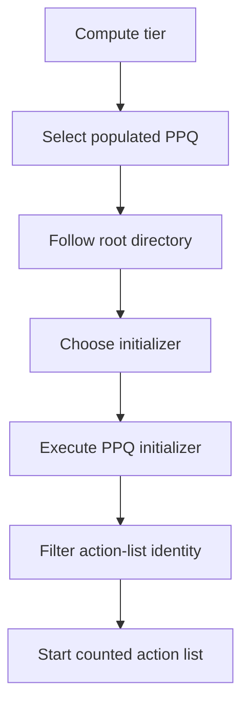

# Professor Pac-Man question-ROM architecture

The fourteen `ppq` EPROMs are executable presentation modules, not a flat
database of question records. Each 16 KB bank combines compiled TERSE,
byte-counted action lists, text, graphics, animation data, and parameters for
procedurally varied questions. The fixed program selects a bank and difficulty
bucket, executes one initializer in that bank, then passes the returned action
list to the task system.

## Runtime mapping

A question selector `$80-$8D` maps one `ppq` device at `$4000-$7FFF` while
retaining `pps3` at `$8000-$9FFF` and `pps4` at `$A000-$BFFF`. The fixed ROMs
remain at `$0000-$3FFF` and `$C000-$DFFF`, so a PPQ thread can call the resident
TERSE vocabulary, configuration-0 presentation words, and fixed game code.



`SELECT_NONREPEATING_QUESTION` performs the path from tier calculation through
the history filter. `START_COUNTED_ACTION_LIST` consumes the accepted result.

## Directory grammar

Every populated PPQ bank begins with the same three-level structure. All
addresses are little-endian CPU addresses in the active `$4000-$7FFF` window.

| Level | Encoding | Meaning |
| --- | --- | --- |
| Bank header at `$4000` | `dw root` | Address of the bank's eight-entry root directory |
| Root directory | `dw bucket[8]` | One bucket pointer for each selection tier |
| Bucket | `db count`, `dw initializer[count]` | Candidate PPQ colon definitions for that tier |
| Initializer | compiled TERSE beginning with `RST $08` | Configures a question variant and returns an action-list address |
| Action list | `db count`, `dw action[count]` | Ordered execution tokens started by the fixed program |

The shipped set contains no null root entries and every one of the 201 bucket
references points to a PPQ colon entry. Repeated initializer pointers across
buckets deliberately carry a question family into adjacent tiers.

## Tier selection

`COMPUTE_QUESTION_BUCKET_OFFSET` calculates the root-directory byte offset:

```text
offset = min(14, 2 * (question_sequence / 6) + (bonus_question ? 8 : 0))
slot   = offset / 2
```

The normal sequence therefore advances one slot every six questions and
saturates at slot 7. Bonus questions begin at slot 4 and advance through the
upper four slots.

| Root slot | Byte offset | Normal sequence | Bonus sequence |
| ---: | ---: | --- | --- |
| 0 | `$00` | 0-5 | — |
| 1 | `$02` | 6-11 | — |
| 2 | `$04` | 12-17 | — |
| 3 | `$06` | 18-23 | — |
| 4 | `$08` | 24-29 | 0-5 |
| 5 | `$0A` | 30-35 | 6-11 |
| 6 | `$0C` | 36-41 | 12-17 |
| 7 | `$0E` | 42 and later | 18 and later |

The selector computes the tier once, then tries randomly selected populated
banks at that same tier until it obtains an acceptable action list.

## Initializers and action lists

The bucket does not point to text or a fixed record header. It points to code.
That code can select a random variant, store parameters used by later actions,
construct procedural state, and return one action-list address. The list
address is both an executable presentation descriptor and the identity used by
the repeat filter.

The first `ppq1` family is a compact example. Its tier-0 bucket points to the
initializer at `$539E`:

```text
PPQ1_INITIALIZER_539E:
    LITBYTE 2
    RANDOM_BELOW
    SET_QUESTION_VARIANT_BYTE
    LIT $5395
    RETURN
```

The initializer chooses variant 0 or 1 and returns this four-action list:

```text
$5395:  db 4
        dw $52AA, $52DE, $5327, $535F
```

`START_COUNTED_ACTION_LIST` reads the count, walks the word array, prepares
each action through the game's task machinery, and `EXECUTE`s each entry. The
actions perform the staged drawing, prompting, input, answer, and cleanup work
for the family.

The associated prompts demonstrate the text representation. Text is stored as
a one-byte character count followed by un-terminated ASCII:

```text
$5204:  db 27, "which is the mirror image ?"
$5220:  db 34, "which is the same flock of birds ?"
```

Other initializers return the same list after changing its variant state. This
is how one compiled action graph produces multiple visible questions without
duplicating the whole presentation program.

Across the complete question set, 130 rooted initializers collapse to 45
distinct action-list identities. All 45 lists contain four actions and all 45
graphs reach the shared scene, three-slot answer-placement, child-join, yield,
and completion words established by the `ppq1` family. The transitive closure
contains 401 bank-local colon definitions and 10,532 TERSE cells. All action
lists, outer actions, internal words, branches, inline operands, strings, and
case tables are represented structurally in `src/ppq1.asm` through
`src/ppq14.asm`. The initializer layer
therefore controls family selection and procedural variation; the returned
list selects the reusable presentation graph used as the repeat-filter
identity.

The bank-by-bank family names, initializer counts, tier coverage, random
ranges, offsets, directly reached prompts, and renderer/animation features are
in [question_families.md](question_families.md).

The complete path for this family—including its four action tasks, nested image
actions, three-slot permutation, selected-answer comparison, and scheduler
completion contract—is documented in
[question_family_ppq1.md](question_family_ppq1.md).

## Repeat suppression

The fixed program retains sixteen action-list addresses in a circular history.
Because the stored identity is the returned list rather than the initializer,
multiple initializers that feed the same presentation family are treated as
one question for repetition purposes.

Selection normally rejects a candidate found anywhere in the sixteen-entry
history. Every fifth candidate uses a relaxed comparison against only the
current history entry. A second counter begins at sixteen; its final relaxed
test, the eightieth initialized candidate, is accepted unconditionally. Empty
bank probes occur before initializer execution and do not consume this budget.
This bounded policy preserves variety while guaranteeing forward progress for
sparsely populated tier/bank combinations.

## Populated-bank inventory

Bucket counts are listed in root-slot order from 0 through 7. “References”
counts every bucket entry; “Unique initializers” removes repeated pointers
within that physical bank.

| Bank | Root | Bucket counts | References | Unique initializers |
| --- | ---: | --- | ---: | ---: |
| `ppq1` | `$7B60` | `1/2/3/2/2/2/2/1` | 15 | 8 |
| `ppq2` | `$7CF7` | `3/3/2/4/2/3/3/3` | 23 | 16 |
| `ppq3` | `$79A2` | `1/2/2/1/2/1/1/1` | 11 | 8 |
| `ppq4` | `$7487` | `2/2/2/2/2/2/1/1` | 14 | 10 |
| `ppq5` | `$7EB0` | `2/2/3/3/3/2/2/2` | 19 | 14 |
| `ppq6` | `$7B76` | `1/3/2/3/2/2/2/2` | 17 | 17 |
| `ppq7` | `$7DEF` | `1/2/1/3/1/2/2/1` | 13 | 9 |
| `ppq8` | `$7E37` | `1/1/2/1/1/1/1/1` | 9 | 8 |
| `ppq9` | `$7DF5` | `5/4/2/1/1/4/4/1` | 22 | 5 |
| `ppq10` | `$781C` | `1/1/2/1/2/1/2/1` | 11 | 4 |
| `ppq11` | `$770A` | `1/1/1/1/1/2/2/2` | 11 | 9 |
| `ppq12` | `$7A2C` | `1/1/1/1/1/1/1/1` | 8 | 2 |
| `ppq13` | `$7E95` | `3/4/3/1/1/1/1/1` | 15 | 13 |
| `ppq14` | `$7211` | `2/2/2/2/1/1/1/2` | 13 | 7 |

Together the roots contain 201 references to 130 bank-local unique
initializers. Those figures are entry-point counts, not the number of visible
questions. Random variants, generated layouts, animation sequences, and shared
action graphs multiply the visible question set; this executable structure is
the technical basis for the cabinet's advertised animated question library.

## Source organization

Each physical question EPROM has an independent assembly unit,
`src/ppq1.asm` through `src/ppq14.asm`, because every device occupies the same
CPU window at `$4000-$7FFF`. Shared mapping and format constants are defined in
`src/profpac_question_common.include`.

Within each unit, the bank-header pointer, root directory, tier buckets, and
rooted initializer entry points are symbolic. The complete payload remains at
its original CPU addresses, including action threads, strings, graphics,
tables, unused space, and erased fill. This representation assembles directly
to the physical 16 KB device image and preserves the address relationships
required by its threaded code and data.

`build.sh` assembles all fourteen units with zmac 1.3, prints the expected and
actual SHA-1 for every output, and compares each image byte-for-byte with its
MAME baseline member. The PPQ images are packaged with the nine independently
assembled program ROMs to produce the complete MAME set.

## Content classes

The PPQ payloads combine several representations under the same directory:

- compiled TERSE initializers and action bodies;
- counted action lists and pointer tables;
- counted prompt and answer strings;
- bitmap, shape, sequence, and animation data;
- numeric parameters and randomized layout inputs.

Examples include mirror-image comparison, flock matching, missing-sequence
completion, circle and line counting, visual memory, spatial turns, cube and
die reasoning, and procedural figure completion. A PPQ bank can emphasize
text, graphics, or generated geometry; there is no universal fixed-size
question or answer record beneath the common directory and action-list layers.

## Reproducible inspection

`tools/analyze_question_banks.py` validates all fourteen bank sizes, root and
bucket bounds, and the `RST $08` entry byte at every rooted initializer. It
also reproduces the inventory table:

```sh
python3 tools/analyze_question_banks.py roms/orig/profpac.zip
python3 tools/analyze_question_banks.py --details roms/orig/profpac.zip
```

The first form prints the summary. `--details` additionally prints every bucket
address and initializer pointer.

`tools/analyze_question_families.py` follows each rooted initializer to its
returned action list, groups aliases by the identity used by the repeat
filter, walks every reachable PPQ action graph, verifies the common four-stage
contract, extracts directly referenced counted prompts, and checks both the
canonical initializer source and every structured action graph:

```sh
python3 tools/analyze_question_families.py --check-sources roms/profpac.zip
```
