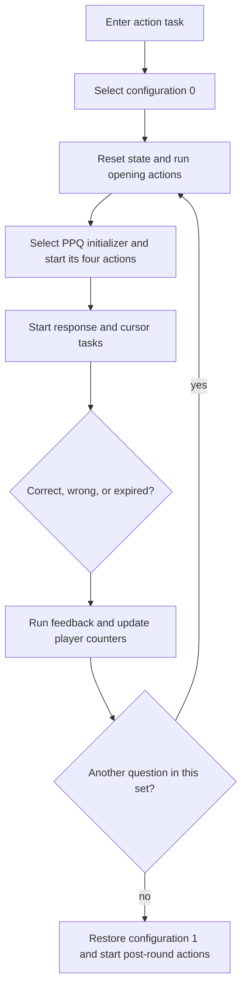

# Professor Pac-Man question-round controller

The fixed-ROM word `QUESTION_ROUND_CONTROLLER` is the executive for one
question cycle. It does not draw a complete question itself. It selects the
active program-bank configuration, starts counted action lists, waits for the
scheduler tasks behind those lists, evaluates the selected answer, updates
per-player round state, selects feedback and bonus paths, and hands control
back to the configuration-1 application.

The controller and its scheduler closure comprise 130 colon definitions and
3,989 TERSE cells in `pps3`, `pps4`, `pps8`, and `pps9`. Seventeen counted
action lists connect those definitions. `tools/analyze_question_round.py`
decodes this graph in both bank contexts and verifies that the source retains
the same definitions and list members.

## Executive sequence



The first bank change is part of the question contract. Configuration 0 maps
`pps3` and `pps4` into the upper program windows; selecting a PPQ ROM replaces
the lower window without disturbing them. The last bank change is equally
important: the controller restores configuration 1 before it dereferences the
application-return pointer at `$C002`. Its `$BCDB` action is therefore
`MAIN_PROGRESSION_TASK` in `pps8`, not bytes at the same CPU address in
`pps4`.

## Phase map

| Phase | Controller operation | Scheduler work |
| --- | --- | --- |
| Entry | Enter the current action task, select configuration 0, initialize screen/intercept state, and clear response latches | Fixed initialization words prepare the object and screen systems |
| Opening | Select bonus, standard, or bank-window opening actions from the current round flags | Scene, round-open, player-prompt, and bank-window tasks run as required |
| Question selection | Call `SELECT_NONREPEATING_QUESTION`; the chosen PPQ initializer returns its four-action descriptor | The PPQ setup, correct-answer, and two distractor actions construct the question |
| Response setup | Clear the selected-response state, arm input, then start the fixed response, answer-selection, and cursor lists | Timer, response display, input gate, selection, and cursor tasks execute cooperatively |
| Decision | Test `QUESTION_SELECTED_SLOT_ADDR` against `QUESTION_CORRECT_SLOT_ADDR`, while also observing timeout and bonus state | Feedback tasks render the visible result and complete their child actions |
| Accounting | Update the active player's paired counters, the set-complete latch, and bonus/round mode | Status and result tasks display the accumulated outcome |
| Continuation | Branch back to the opening phase while the player/set condition remains active | A new PPQ family is selected on the next pass |
| Exit | Restore configuration 1, copy the configured sound flag into live state, start `MAIN_PROGRESSION_ACTIONS`, and restore the interrupt/display environment | `MAIN_PROGRESSION_TASK` performs the application-level handoff |

## Counted action lists

The byte at the start of each descriptor is an action count followed by that
many execution-token addresses. `START_COUNTED_ACTION_LIST` creates the child
tasks and increments the parent's outstanding-child count; the controller's
yield points resume only after those scheduled paths have progressed.

| Descriptor | Count | Actions |
| --- | ---: | --- |
| `BONUS_QUESTION_OPEN_ACTIONS` | 3 | `QUESTION_SCENE_OPEN_TASK`, `QUESTION_ROUND_OPEN_TASK`, `PLAYER_PROMPT_TASK` |
| `STANDARD_QUESTION_OPEN_ACTIONS` | 1 | `QUESTION_ROUND_OPEN_TASK` |
| `BANKED_QUESTION_OPEN_ACTIONS` | 2 | `QUESTION_BANK_WINDOW_TASK`, `QUESTION_ROUND_OPEN_TASK` |
| `ROUND_STATUS_ACTIONS` | 1 | `ROUND_STATUS_DISPLAY_TASK` |
| `RESPONSE_INPUT_ACTIONS` | 3 | `RESPONSE_CONTROL_TASK`, `RESPONSE_DISPLAY_TASK`, `RESPONSE_TIMER_TASK` |
| `ANSWER_SELECTION_ACTIONS` | 2 | `ANSWER_SELECTION_TASK`, `ANSWER_INPUT_GATE_TASK` |
| `ANSWER_CURSOR_ACTIONS` | 1 | `ANSWER_CURSOR_TASK` |
| `RESPONSE_FEEDBACK_ACTIONS` | 1 | `RESPONSE_FEEDBACK_TASK` |
| `ROUND_INTRO_ANIMATION_ACTIONS` | 1 | one `pps4` animation task |
| `ROUND_MESSAGE_ANIMATION_ACTIONS` | 3 | three `pps4` message-animation tasks |
| `ROUND_RESULT_ANIMATION_ACTIONS` | 2 | two fixed result-animation tasks |
| `MAIN_PROGRESSION_ACTIONS` | 1 | configuration-1 `MAIN_PROGRESSION_TASK` |

The fixed dispatch directory also contains `MAIN_CONTROL_ACTIONS`,
`ATTRACT_CHALLENGE_PROMPT_ACTIONS`, `ATTRACT_DEMO_QUESTION_ACTIONS`,
`GAME_OVER_ACTIONS`, and `CREDIT_START_PROMPT_ACTIONS`. They share the same list representation and are
validated with the round graph because the configuration-1 transition code
selects among them.

## The PPQ handoff

The central handoff is short because the selector and the question family use
the parameter stack as their interface:

```asm
        dw      XT_SELECT_NONREPEATING_QUESTION
        dw      XT_START_COUNTED_ACTION_LIST
        dw      XT_YIELD_ACTION_TASK
```

`SELECT_NONREPEATING_QUESTION` returns the counted action-list address from the
chosen PPQ initializer. The next word consumes that descriptor and starts its
four tasks. No fixed table needs to understand the internal layout of an
individual question family.

Answer correctness has an equally narrow interface:

```asm
IS_SELECTED_ANSWER_CORRECT:
        ; Fetch byte at QUESTION_SELECTED_SLOT_ADDR.
        ; Fetch byte at QUESTION_CORRECT_SLOT_ADDR.
        ; Return their TERSE equality result.
```

This separates presentation from policy. PPQ and `pps3` code determine which
slot is correct and draw the three alternatives; the fixed controller decides
which feedback, accounting, and continuation path follows the comparison.

## Controller state

| Address | Symbol | Demonstrated role |
| ---: | --- | --- |
| `$E13D` | `CURRENT_PLAYER_INDEX_ADDR` | Selects the active player's paired round fields and player-specific display paths |
| `$E13E` | `BONUS_QUESTION_FLAG_ADDR` | Selects bonus opening and bonus-completion behavior |
| `$E13F` | `QUESTION_SET_COMPLETE_ADDR` | Set when the active player's inner count reaches its terminal state |
| `$E142`, `$E144` | `PLAYER_1_ROUND_COUNT_ADDR`, `PLAYER_2_ROUND_COUNT_ADDR` | Player-specific counts tested against the operator `BONUS EVERY` setting |
| `$E146` | `QUESTION_ROUND_MODE_ADDR` | Small mode value used by input, feedback, and bonus transitions |
| `$E147` | `QUESTION_MODE_FLAGS_ADDR` | Selects initialization and opening variants |
| `$E1EF` | operator `SHILL SOUNDS` byte | Copied to live state when configuration 1 is restored |
| `$E1F3` | operator `BONUS EVERY` byte | Compared with the player round counts to schedule bonus questions |
| `$F6FA` | `QUESTION_ACTION_COMPLETE_ADDR` | Shared PPQ action-completion latch |
| `$F705` | `QUESTION_RESPONSE_LATCH_ADDR` | Cleared at entry and tested throughout response resolution |
| `$F706` | `QUESTION_CORRECT_SLOT_ADDR` | Randomized correct-answer slot |
| `$F721` | `QUESTION_INPUT_ARMED_ADDR` | Arms the response path after presentation |
| `$F726` | `QUESTION_SELECTED_SLOT_ADDR` | Slot chosen by the player |
| `$F728` | `QUESTION_INPUT_STATE_ADDR` | Cleared before response acquisition |
| `$F755` | `QUESTION_RESPONSE_READY_ADDR` | Coordinates response and feedback tasks |
| `$F757` | `QUESTION_CURSOR_STATE_ADDR` | Reset before answer-selection tasks begin |

These names describe proven use in the controller and its reachable tasks.
They do not assert original DNA source spellings.

## Source and verification

The graph is emitted in physical-ROM source, so identical CPU addresses in
different bank configurations never share an assembly label. Cross-ROM
execution tokens use explicit `CFG0_` or `CFG1_` aliases.

Run the focused check directly with:

```sh
python3 tools/analyze_question_round.py --check-sources roms/profpac.zip
```

`build.sh` runs the same check after assembling all 23 processor-visible ROMs,
constructing the MAME archive, comparing it byte-for-byte with the baseline,
and verifying the canonical archive SHA-1.
