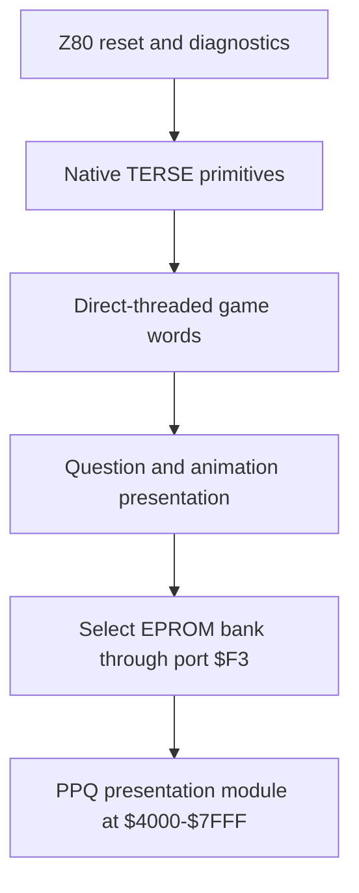
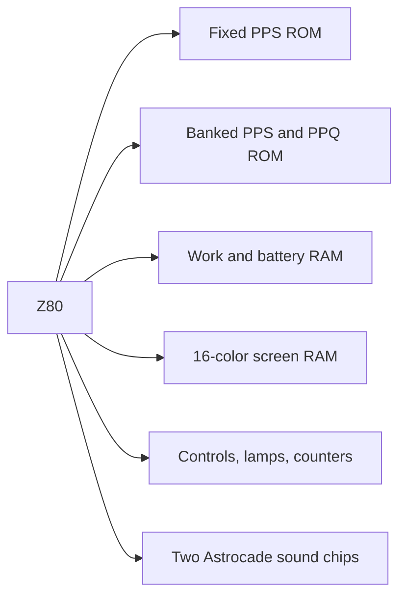

# Professor Pac-Man disassembly

Professor Pac-Man is a 1983 quiz game developed by Dave Nutting Associates and
published by Bally Midway. It uses the final and most heavily expanded member
of the Astrocade arcade hardware family: a Z80, 16-color screen RAM, stereo
Astrocade sound, banked program ROM, and a 640 KB EPROM board containing the
animated question library.

The source preserves the physical ROM organization, documents the complete MAME
memory layout, identifies the reset and threaded-runtime entry points, and
maps the executable question-ROM architecture. Native Z80 bodies are
expressed mnemonically; TERSE definitions use structured execution tokens and
inline operands; graphics and unclassified tables retain addressed byte
definitions that reproduce the original devices exactly.

## Contents

- `src/pps1.asm`-`src/pps9.asm` - byte-exact source for the nine program ROMs
- `src/ppq1.asm`-`src/ppq14.asm` - byte-exact source for the fourteen question ROMs
- `src/profpac_common.include` - shared hardware and runtime definitions
- `src/profpac_question_common.include` - shared PPQ mapping and format definitions
- `build.sh` - assembles and verifies all twenty-three ROMs
- `tools/analyze_question_banks.py` - validates PPQ directories and tiers
- `tools/analyze_question_families.py` - validates family identities, action
  graphs, prompts, features, and symbolic initializer source
- `hardware.md` - CPU, memory, banking, video, sound, and control interface
- `native_code.md` - native-code coverage and reset, interrupt, banking, I/O,
  video, sound, input, and self-test paths
- `terse.md` - threaded-runtime architecture and register model
- `terse_vocabulary.md` - resident words, stack effects, and cross-game lineage
- `threaded_code.md` - colon definitions, execution-token coverage, and roots
- `question_roms.md` - PPQ directories, tiers, initializers, action lists, and
  repeat suppression
- `question_families.md` - all 45 action-list families, 130 rooted
  initializers, tier coverage, variant setup, prompts, and execution features
- `question_family_ppq1.md` - complete mirror-image/flock family execution,
  slot randomization, rendering, evaluation, and task completion
- `self_test.md` - service menus, diagnostics, statistics, and operator settings
- `development_status.md` - reverse-engineering coverage and planned work
- `roms/orig/profpac.zip` - canonical MAME archive used for verification

The fourteen `ppq` ROMs form the banked question and presentation library.
Each bank contains executable TERSE initializers, counted action lists, text,
graphics, and procedural parameters behind a common eight-tier directory.
The ten `pls153a` files contain programmable-logic fuse maps for the CPU, EPROM,
game, and screen-RAM boards. They describe hardware logic rather than Z80
address-space contents.

## Build

Requirements:

- zmac 1.3 at `tools/zmac`
- Python 3 and POSIX shell utilities including `cmp`, `sha1sum`, and `unzip`
- an unmodified MAME `profpac` ROM set

Place the canonical MAME archive at `roms/orig/profpac.zip`, then run:

```sh
chmod +x build.sh
./build.sh
```

The script assembles every physical ROM independently: nine 8 KB program ROMs
and fourteen 16 KB question ROMs. For each image it prints the expected and
actual SHA-1, rejects a mismatch, and compares the bytes with the corresponding
member of the MAME archive. Verified images are written as `roms/pps1` through
`roms/pps9` and `roms/ppq1` through `roms/ppq14`; zmac listings remain under
`build/`.

The script then creates a new 33-member TorrentZip-compatible
`roms/profpac.zip` from the twenty-three assembled ROMs and the ten unchanged
PLD members carried from the baseline. The generated archive is tested,
compared byte-for-byte with the baseline, and checked against the canonical
SHA-1
`fc2c27f04a1a173ae79b5fb91c69ff85cc479c9c`.

Expected program-ROM SHA-1 values:

| ROM | SHA-1 |
| --- | --- |
| `pps1` | `f7a9606ce6d66c3e6d210cc25572904aeab2b6c8` |
| `pps2` | `b730b24088dcfddbe954670ff9212b7383c923f6` |
| `pps3` | `ffbb156f417d20478117b39de28a15680993b528` |
| `pps4` | `33c797c690801afded45091d822347e1ecc72b54` |
| `pps5` | `fb4d3ba40697425d69ee19bfdcf00aea1df5fa80` |
| `pps6` | `f706cef6518b7d839377aa8a7c75fdeed4985c57` |
| `pps7` | `201b930cca9669114ffc97978cade69587e34a0f` |
| `pps8` | `786b30cd7a7db55bdde05909d7a1a7f122b6e546` |
| `pps9` | `8b7ed84090dbc5181deef6f55ec755c05d4c0d5e` |

Expected question-ROM SHA-1 values:

| ROM | SHA-1 |
| --- | --- |
| `ppq1` | `d81caaa639f63d971a0d3199b9da6359211edf3d` |
| `ppq2` | `f9455868c70f479ede0e0621f21f69da165d9b7a` |
| `ppq3` | `24fb14c6b31b7f27e0737605cfbf963d29dd3fc5` |
| `ppq4` | `92d2391e4c8aef46cc8e92b8cf9a8ec9a1b5ff68` |
| `ppq5` | `d5d6afaadb022b109c14c3911eceb0769204df6c` |
| `ppq6` | `45b4925709da6790676319268398f6cfcf12794b` |
| `ppq7` | `f2f09fdb13920012a6a43958b640d7a06c0c8e69` |
| `ppq8` | `e8fe02c85e90320680a14ad560204d5c235730ad` |
| `ppq9` | `2f03f799c319309b5ebf9a5299891d1824398ba5` |
| `ppq10` | `db991b93001d2da16b398ee8e9b01b8f0dfe5740` |
| `ppq11` | `7f68a8b89117b7ab8724869401a861fe7cff28d9` |
| `ppq12` | `c7052bf9ce9d2006dda5ddc07ad164d0119b86ea` |
| `ppq13` | `d47655300c8747698a46f30deb65fe762073e869` |
| `ppq14` | `73d28a79b76795d3016dd608f9ab3d255f40e477` |

## Program architecture



The native kernel and threaded application share the program ROMs. Compiled
colon definitions begin with `RST $08`; the runtime at `$0008` transfers the
nested thread address into `BC`, and `TERSE_NEXT` at `$00F6` fetches each
following 16-bit execution token. See [native_code.md](native_code.md) and
[terse.md](terse.md). The decoded colon definitions and control-flow roots are
mapped in [threaded_code.md](threaded_code.md).

## ROM organization

| Devices | Physical capacity | Role |
| --- | ---: | --- |
| `pps1`, `pps2` | 16 KB | Fixed ROM at `$0000-$3FFF` |
| `pps3`-`pps8` | 48 KB | Banked program, graphics, and table data |
| `pps9` | 8 KB | Fixed ROM at `$C000-$DFFF` |
| `ppq1`-`ppq14` | 224 KB populated | Question and animation EPROM data |
| PLD dumps | 10 devices | Address decoding and board control logic |

The installed EPROM board is physically capable of 640 KB. This ROM set
populates fourteen 16 KB question devices, not 640 KB of question content.
MAME allocates a 640 KB region and leaves the unused space erased.

## Question architecture

The first word of every populated PPQ bank points to an eight-entry root
directory. Each root entry selects a byte-counted array of TERSE initializer
pointers. An initializer configures a variant and returns a counted action
list, which the fixed program installs and executes through the task system.

The 201 directory references resolve to 130 bank-local initializer entry
points and 45 distinct action-list families. Every family uses a four-action
presentation contract: scene setup, randomized correct-answer placement,
distinct second-answer placement, remaining-slot placement, child-action
synchronization, cooperative yield, and completion. The complete family and
feature matrix is in [question_families.md](question_families.md).

Normal play advances one root slot every six questions. Bonus play adds four
slots and therefore uses the upper half of the tier directory. A sixteen-entry
ring suppresses recently used action-list identities, with a bounded escape
policy for sparse tier/bank combinations. The complete grammar, selector
formula, worked `ppq1` example, and bank inventory are in
[question_roms.md](question_roms.md).

## Hardware overview



Detailed addresses and bank behavior are maintained in
[hardware.md](hardware.md).

## Self-test surface

The operations manual documents unusually extensive built-in diagnostics:

- 16-color write-mode and intercept tests
- screen RAM, scratch-pad RAM, and write-protect tests
- Super Game and 16K ROM tests
- continuous heat testing with retained pass, error, and reset counters
- crosshatch, color-bar, grey-level, and purity displays
- stereo sound, switch, lamp, LED, and coin-counter tests
- bookkeeping statistics and operator game settings

These screens define behavioral anchors for routine identification because
their observable results are specified independently of the ROM. Their decoded
TERSE dispatch hierarchy and execution tokens are mapped in
[self_test.md](self_test.md).

## Provenance

The binary baseline is the MAME `profpac` set described by
`src/mame/bally/astrocde.cpp`. Hardware names, board numbers, switch meanings,
and diagnostic descriptions are drawn from the Bally Midway Professor Pac-Man
operations manual and its schematics.

Documented production credits identify Dave Nutting Associates as developer,
Rick Frankel as programmer, Mark Steven Pierce and Sue Forner for graphics,
and Marc Canter for sound and music. Johnny Lott and *RePlay* publisher Ed
Adlum originated the earlier Pac-Man-plus-quiz proposal; the shipped game is
the DNA animated multiple-choice design.
