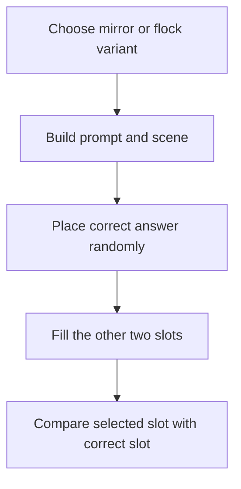

# PPQ1 mirror-image and flock-matching family

The first rooted family in `ppq1` is a complete example of Professor Pac-Man's
executable question format. One initializer selects either a mirror-image
question or a same-flock question. Both variants reuse one four-stage TERSE
action graph, the same three randomized answer slots, and the common fixed-ROM
answer evaluator.

This family is available in root tiers 0 and 2 through
`QUESTION_INITIALIZER_539E`.

## Execution path



The PPQ initializer returns `MIRROR_FLOCK_ACTION_LIST`. The fixed
`START_COUNTED_ACTION_LIST` word creates the four action tasks in list order.
Scheduler state and explicit yields control their visible timing. Each action
terminates through `COMPLETE_QUESTION_ACTION` after its drawing or child work
has completed.

## Variant selection

The initializer is compact TERSE:

```z80
QUESTION_INITIALIZER_539E:
        rst     $08
        dw      XT_LITbyte
        db      $02
        dw      XT_RANDOM_BELOW
        dw      CFG0_XT_SET_QUESTION_VARIANT_BYTE
        dw      XT_LIT
        dw      MIRROR_FLOCK_ACTION_LIST
        dw      XT_RETURN
```

`RANDOM_BELOW 2` produces variant 0 or 1. The value is stored at
`QUESTION_VARIANT_ADDR` and indexes `MIRROR_FLOCK_PROMPT_TABLE`:

| Variant | Prompt |
| ---: | --- |
| 0 | `which is the mirror image ?` |
| 1 | `which is the same flock of birds ?` |

The initializer returns the same action-list address for both variants.
Consequently the recent-question filter treats the two visible forms as one
question family, while the stored variant changes the prompt and rendering
mode inside the action graph.

## Four-stage action graph

`MIRROR_FLOCK_ACTION_LIST` contains four TERSE execution tokens:

| Stage | Source label | Function |
| ---: | --- | --- |
| 1 | `MIRROR_FLOCK_SETUP_ACTION` | Select the prompt, install the scene tables, and draw the primary flock object. |
| 2 | `MIRROR_FLOCK_FIRST_ANSWER_ACTION` | Choose the randomized correct slot, install the correct candidate, and start its three image-component actions. |
| 3 | `MIRROR_FLOCK_SECOND_ANSWER_ACTION` | Choose a different slot and install the first distractor with the variant-specific render mode. |
| 4 | `MIRROR_FLOCK_REMAINING_ANSWER_ACTION` | Use the only unoccupied slot and install the second distractor with the complementary render mode. |

The scene uses two principal bitmap payloads:

| Object | Address | Role |
| --- | ---: | --- |
| `PPQ1_PRIMARY_FLOCK_BITMAP` | `$4A72` | Primary flock image data |
| `PPQ1_MIRRORED_FLOCK_BITMAP` | `$4C98` | Mirrored flock image data |

`MIRROR_FLOCK_IMAGE_TABLE` points to three additional image descriptors at
`$517D`, `$51A8`, and `$51D3`. The child list at
`MIRROR_FLOCK_IMAGE_ACTION_LIST` starts one task for each corresponding image
descriptor at `$50AF`, `$50E5`, and `$5131`. These task-level components allow
the presentation to compose and animate the answer object without duplicating
the outer question logic.

## Slot randomization

Answer position is independent of question variant. The shared configuration-0
words implement a three-slot permutation:

1. `PLACE_CORRECT_ANSWER_RANDOM_SLOT` chooses a value from 0 through 2, stores
   the current task in `QUESTION_SLOT_TASK_TABLE_ADDR[slot]`, and records the
   slot at `QUESTION_CORRECT_SLOT_ADDR`.
2. `PLACE_DISTRACTOR_IN_SECOND_SLOT` repeatedly samples 0 through 2 until it
   differs from the correct slot.
3. The remaining slot is calculated as
   `3 - (correct_slot OR second_slot)` and stored at
   `QUESTION_REMAINING_SLOT_ADDR`.
4. `PLACE_DISTRACTOR_IN_REMAINING_SLOT` assigns the last candidate to that
   stored slot.

For the distinct values 0, 1, and 2, the OR expression identifies the missing
index without a lookup table:

| Occupied slots | OR | Remaining slot |
| --- | ---: | ---: |
| 0 and 1 | 1 | 2 |
| 0 and 2 | 2 | 1 |
| 1 and 2 | 3 | 0 |

This makes every slot eligible to hold the correct candidate and guarantees
that all three positions are occupied exactly once.

## Answer evaluation

The presentation code records slot identity; it does not embed a fixed answer
button in the PPQ record. The shared input path writes the player's chosen slot
to `QUESTION_SELECTED_SLOT_ADDR`. `IS_SELECTED_ANSWER_CORRECT` performs the
complete family-independent evaluation:

```z80
IS_SELECTED_ANSWER_CORRECT:
        rst     $08
        dw      XT_LIT
        dw      QUESTION_SELECTED_SLOT_ADDR
        dw      XT_Bat
        dw      XT_LIT
        dw      QUESTION_CORRECT_SLOT_ADDR
        dw      XT_Bat
        dw      XT_equal
        dw      XT_RETURN
```

The result is a canonical TERSE Boolean. Scoring, response feedback, and round
progression remain in the fixed question controller, so this PPQ family needs
only to construct the visible choices and publish the randomized correct slot.

## Task completion

Every outer action ends with `COMPLETE_QUESTION_ACTION`. That shared word sets
`QUESTION_ACTION_COMPLETE_ADDR` to one and clears the current task's active
bit. The scheduler can then release dependent work and advance the fixed
question controller. The family therefore has no private polling loop or
input handler; it uses the same action lifecycle as the rest of the PPQ
library.

## Source coverage

The byte-exact implementation is in `src/ppq1.asm`. The following objects are
now expressed structurally:

- the two counted prompt strings and their variant-indexed pointer table;
- the scene, answer, image, and style tables;
- the three child image actions and their counted action list;
- all four outer presentation actions, including branch targets and inline
  operands;
- the rooted initializer and returned action list;
- the fixed/configuration-0 task words and RAM fields required to prove slot
  assignment, answer evaluation, and completion.

All source labels preserve the original CPU addresses, and the assembled
`ppq1` image retains SHA-1
`d81caaa639f63d971a0d3199b9da6359211edf3d`.
