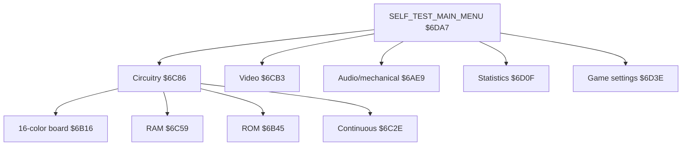

# Self-test and operator program

Professor Pac-Man's self-test/operator program is the direct-threaded TERSE
application entered at `$6DD2` while the active-low cabinet test switch is
asserted during reset. It validates retained RAM and enters the five-category
menu rooted at `SELF_TEST_MAIN_MENU` (`$6DA7`). The fixed `$DEBD` wrapper and
the `$BE66` configuration-1 application belong to normal play.

The menu names, ordering, and behavior below agree with the Bally Midway operations manual and the counted strings and `CASES` tables in `pps6`.

## Controls

The right-player answer buttons operate every service menu:

| Button | Function |
| --- | --- |
| A | Move cursor up or increase the selected value |
| B | Select an item or leave the active editor/test |
| C | Move cursor down or decrease the selected value |

Turning the cabinet test switch off does not immediately abandon a nested screen. Selecting `RETURN`, `REPEAT`, or `EXIT`, as appropriate to the current level, returns to normal execution.

## Menu hierarchy

`DISPLAY_SERVICE_MENU` (`$6847`) renders a menu from the resident pointer tables. `SELECT_SERVICE_MENU_ITEM` (`$68FD`) runs the A/B/C cursor loop and returns the selected zero-based index. Each category dispatches that index through a bounded `CASES` table.

## Circuitry tests

| Manual function | Execution token | Source label |
| --- | ---: | --- |
| Write modes | `$5CDC` | `WRITE_MODES_CIRCUIT_TEST` |
| Intercept | `$58ED` | `INTERCEPT_CIRCUIT_TEST` |
| Screen RAM | `$4E47` | `SCREEN_RAM_TEST` |
| Scratch pad | `$4FEE` | `SCRATCHPAD_RAM_TEST` |
| Write-protect | `$50EE` | `WRITE_PROTECT_RAM_TEST` |
| Super Game Card | `$5469` | `SUPER_GAME_CARD_ROM_TEST` |
| 16K card | `$5576` | `EPROM_16K_CARD_TEST` |
| 32K ROM card | `$5650` | `ROM_32K_CARD_TEST` |

`USE_32K_ROM_CARD_LAYOUT` (`$51FD`, stack effect `( -- flag )`) reads the retained DIP state and selects the ROM-test presentation required by setting switch 5. The switch changes the displayed device organization, not normal game operation.

The write-mode test exercises PLOP, XOR, transparent, and reverse transfers. The intercept test verifies intercept bits and pixel/plane combinations. RAM tests cover screen RAM, the static-RAM ranges, and the protected-write aperture. ROM tests select and checksum the populated Super Game and EPROM-board regions.

## Continuous test

`CONTINUOUS_TEST_MENU` (`$6C2E`) offers two paths:

| Selection | Execution token | Operation |
| --- | ---: | --- |
| Start new test | `$6C17` | Clear pass, error, and restart counters, then run the sequence |
| Continue previous test | `$6B7E` | Resume the retained counters and test sequence |

`CONTINUOUS_SELF_TEST_SEQUENCE` (`$6B7E`) runs the circuitry, RAM, and ROM tests repeatedly and updates retained pass state. The cabinet lockup and beep DIP settings control error-stop and audible-result behavior as documented in the manual.

## Video test and adjustment

| Pattern | Execution token | Source label |
| --- | ---: | --- |
| Cross-hatch | `$4BC1` | `VIDEO_CROSSHATCH_TEST` |
| Color bars | `$4C15` | `VIDEO_COLOR_BARS_TEST` |
| Grey levels | `$4CA2` | `VIDEO_GREY_LEVELS_TEST` |
| Purity | `$4CBC` | `VIDEO_PURITY_TEST` |

These are monitor-adjustment patterns. Cross-hatch establishes geometry and convergence, color bars exercise the color channels, grey levels provide sixteen brightness steps, and purity supplies uniform color fields.

## Audio and mechanical tests

| Function | Execution token | Operation |
| --- | ---: | --- |
| Sounds | `$6387` | Generate three simultaneous tones on both Astrocade sound channels |
| Switches | `$6529` | Display live states for cabinet inputs and the eight-position DIP pack |
| Devices | `$6A38` | Select and pulse coin counters, LEDs, and six answer-button lamps |

The device test contains ten dispatch entries: two coin counters, two LEDs, and the left and right A/B/C lamps. Standard cabinets populate one coin counter; the second output remains available for the optional device described by the manual.

## Statistics

| Function | Execution token | Source label |
| --- | ---: | --- |
| Time index, one player | `$5E3A` | `DISPLAY_ONE_PLAYER_TIME_INDEX` |
| Time index, two players | `$5EF3` | `DISPLAY_TWO_PLAYER_TIME_INDEX` |
| Score index | `$5FB2` | `DISPLAY_SCORE_INDEX` |
| Clear one-player time | `$5EDD` | `CLEAR_ONE_PLAYER_TIME_INDEX` |
| Clear two-player time | `$5F9C` | `CLEAR_TWO_PLAYER_TIME_INDEX` |
| Clear score index | `$6067` | `CLEAR_SCORE_INDEX` |

One-player time uses 90-second buckets, two-player time uses 180-second buckets, and score statistics use 5,000-point buckets. The clearing menu affects these histograms and totals; it does not clear the all-time high-score table.

## Game settings

`GAME_SETTINGS_MENU` (`$6D3E`) dispatches nine operator functions in the order encoded by its string and action tables:

| Setting | Execution token | Retained value |
| --- | ---: | ---: |
| Shill sounds | `$6A9D` | `$E1EF` |
| Free play | `$6A94` | `$E1F0` |
| Door 1 coin/credit | `$677E` | `$E1F9/$E1FB`, packed value `$E1F6` |
| Door 2 coin/credit | `$67A9` | `$E1F8/$E1FA`, packed value `$E1F4` |
| Number of fruits | `$6767` | `$E1EE` |
| Bonus every | `$6712` | `$E1F3` |
| Starting difficulty | `$6739` | `$E1F2` |
| Incremental difficulty | `$6750` | `$E1F1` |
| Defaults | `$6AC3` | Writes the complete factory option set |

`DISPLAY_BOOLEAN_OPTION` (`$69D8`) renders the resident `on` or `off` string. `EDIT_BOOLEAN_OPTION` (`$6A2B`) supplies the common editor used by shill sounds and free play. The numeric editors enforce their individual ranges before storing through the protected-memory linkage vocabulary.

Factory defaults are shill sounds off, free play off, both coin doors at 1 coin/1 credit, three fruits, bonus every three correct answers, starting difficulty 3, and incremental difficulty 3. `RESTORE_DEFAULT_OPTIONS` displays `set` after committing those values.

## Stack effects

All menu roots and complete test screens have stack effect `( -- )`. The shared service helpers with externally visible stack contracts are:

| Word | Stack effect |
| --- | --- |
| `DISPLAY_SERVICE_MENU` | `( count -- )` |
| `SELECT_SERVICE_MENU_ITEM` | `( count -- index )` |
| `DISPLAY_BOOLEAN_OPTION` | `( flag -- )` |
| `EDIT_BOOLEAN_OPTION_VALUE` | `( address -- )` |
| `EDIT_BOOLEAN_OPTION` | `( address -- 0 )` |
| `USE_32K_ROM_CARD_LAYOUT` | `( -- flag )` |
