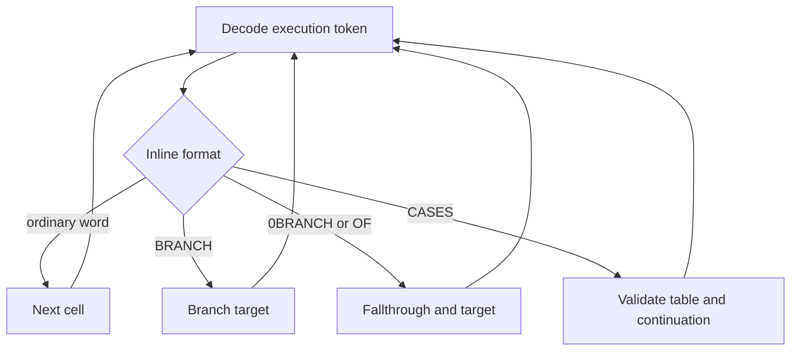

# Threaded code map

Professor Pac-Man stores its high-level program as direct-threaded TERSE
definitions. A colon definition begins with `RST $08`; its body contains
little-endian execution-token addresses, inline operands, branch targets,
counted strings, and bounded `CASES` tables.

`RST $08` places the nested body address on the shared SP stack. The fixed
runtime at `$0008` moves that address into `BC` after saving the caller's `BC`
on IX. `RETURN` at `$00FD` restores the saved threaded instruction pointer.
These are runtime mechanics; the label `TERSE_COLON_ENTRY` does not assert that
the standard glossary word `ENTER` names this operation.

## Coverage

The program ROMs contain 357 structurally validated colon definitions and
4,925 decoded threaded cells.

| ROM | CPU mapping | Colon definitions | Threaded cells |
| --- | --- | ---: | ---: |
| `pps1` | `$0000-$1FFF` fixed | 10 | 80 |
| `pps2` | `$2000-$3FFF` fixed | 60 | 523 |
| `pps3` | `$8000-$9FFF`, configuration 0 | 40 | 405 |
| `pps4` | `$A000-$BFFF`, configuration 0 | 2 | 12 |
| `pps5` | `$4000-$5FFF`, configuration 1 | 140 | 2,370 |
| `pps6` | `$6000-$7FFF`, configuration 1 | 54 | 931 |
| `pps7` | `$8000-$9FFF`, configuration 1 | 0 | 0 |
| `pps8` | `$A000-$BFFF`, configuration 1 | 9 | 154 |
| `pps9` | `$C000-$DFFF` fixed | 42 | 450 |

`pps7` contains graphics, tables, and other data but no validated colon entry.
The fixed-ROM definitions are decoded against both program-bank
configurations; their physical counts are reported once.

## Source representation

Threaded source uses native assembler directives rather than undifferentiated
byte strings:

```z80
INITIAL_THREAD_WORD:
        rst     $08
INITIAL_THREAD:
        dw      XT_VALIDATE_BATTERY_RAM
        dw      XT_LIT               ; _LIT
        dw      $E1DA                ; inline word
        dw      ALIAS_BZERO
        dw      TERSE_COLON_47C5
```

The representation is selected by operand format:

| Construct | Source form |
| --- | --- |
| Execution token | `DW` native or colon-word address |
| `LIT`, `ARRAY`, `BARRAY` operand | `DW` inline value or base address |
| `LITbyte` operand | `DB` inline byte |
| `BRANCH`, `0BRANCH`, `OF` target | `DW` local target label |
| `A"` text | `DB` count and string bytes |
| `CASES` | `DW` end address followed by execution-token table |
| Colon entry | `RST $08` |

A threaded cell split by a physical 8 KB ROM boundary remains byte-defined in
the two independent assembly units. This preserves the physical-device build
without inventing a cross-file linker dependency.

Fixed resident words are emitted through `XT_*` constants from
`profpac_common.include`. The constants carry numeric execution-token values
across independent assembly units; they do not merge the overlapping banked
address spaces or create linker-visible code symbols.

## Control-flow validation

Validation starts at a colon body and follows every TERSE control-flow edge:



A definition is accepted only when every reachable cell resolves to a resident
primitive, a validated native application word, a protected-memory alias, or
another colon definition. The walk terminates at `RETURN`, a non-returning cold
restart, or an already visited loop cell.

This distinguishes real threaded bodies from `$CF` bytes occurring in text,
graphics, or arbitrary tables.

## Initial thread

Cold startup selects the normal threaded instruction pointer at `$6DD2`. The
body is also callable through `INITIAL_THREAD_WORD` at `$6DD1`.

The initial path:

1. validates battery-backed RAM;
2. clears retained initialization state through the protected-memory alias
   table;
3. invokes the configuration-1 initialization words;
4. checks the initialization flag at `$E1D9`;
5. selects the established-state or first-initialization path;
6. enters the repeating application thread at `$6E0B`.

The first-initialization path clears state, initializes hardware/self-test
structures, stores the initial value at `$FEAA`, and enters the main threaded
control word. The established-state path reaches the normal application setup
through the word at `$6B7E`.

## Service thread

The service-switch startup path initializes `BC` to `$DEBE`. Its complete outer
thread is:

```z80
SERVICE_THREAD_WORD:
        rst     $08
SERVICE_THREAD:
        dw      _LITbyte
        db      $20
        dw      _LIT
        dw      $00F3
        dw      _OUTP
        dw      CFG1_SERVICE_APPLICATION_XT ; SERVICE_APPLICATION_WORD
        dw      _RETURN
```

The thread restores program-bank configuration 1 through port `$F3`, invokes
`SERVICE_APPLICATION_WORD` at `$BE66`, and returns. The shared constant carries
that configuration-1 execution token across the independent `pps8` and `pps9`
assembly units.

## Service application call graph

The service application has been resolved from its counted menu strings,
bounded `CASES` tables, hardware accesses, retained variables, and the
operations manual. `SELF_TEST_MAIN_MENU` at `$6DA7` is the top-level operator
dispatcher.

| Menu | Address | Actions |
| --- | ---: | --- |
| Circuitry tests | `$6C86` | 16-color board, RAM, ROM, continuous test |
| Video test/adjust | `$6CB3` | Cross-hatch, color bars, grey levels, purity |
| Audio/mechanical | `$6AE9` | Sounds, switches, output devices |
| Statistics | `$6D0F` | One-player time, two-player time, score, clear statistics |
| Game settings | `$6D3E` | Eight programmable options and factory defaults |

The shared menu words are `DISPLAY_SERVICE_MENU` at `$6847`, with stack effect
`( count -- )`, and `SELECT_SERVICE_MENU_ITEM` at `$68FD`, with stack effect
`( count -- index )`. Each category supplies that index to its own `CASES`
table, so the service hierarchy is explicit in the threaded source rather than
inferred from adjacent data.

Fifty-one service/application entries now carry semantic labels: 50 colon
definitions and the native ROM-layout predicate at `$51FD`. These cover all
manual-visible test roots, statistics displays and clearing operations,
operator-setting editors, continuous-test control, and the shared menu layer.
The complete address and behavior map is maintained in
[self_test.md](self_test.md).

## Protected-memory alias table

Configuration-1 threaded code uses a compact jump table at `$4070-$40A2`.
Each execution token jumps to the canonical resident store word in `pps1`.

| Alias | Target | Operation |
| ---: | ---: | --- |
| `$4070` | `$0532` | `SB!` |
| `$4073` | `$053A` | `BONE` |
| `$4076` | `$053F` | `BZERO` |
| `$4079` | `$0544` | `1-B!` |
| `$407C` | `$0549` | `1+B!` |
| `$407F` | `$054E` | `+B!` |
| `$4082` | `$0555` | `-B!` |
| `$4085` | `$05A3` | `MOVE` |
| `$4088` | `$055C` | `B!` |
| `$408B` | `$0561` | `!` |
| `$408E` | `$056F` | `ONE` |
| `$4091` | `$0569` | `ZERO` |
| `$4094` | `$0575` | `1-!` |
| `$4097` | `$0588` | `1+!` |
| `$409A` | `$057D` | `+!` |
| `$409D` | `$0590` | `-!` |
| `$40A0` | `$059E` | `S!` |

The table acts as a local linkage vocabulary for the banked configuration-1
program. It preserves compact execution-token addresses while sharing the
actual protected-memory implementation in fixed ROM.

## Thread-proven native words

Execution-token references establish native entries that ordinary Z80
`CALL`/`JP` traversal does not identify as public word boundaries.

| Address | Name | Operation |
| ---: | --- | --- |
| `$068B` | `READ_AND_VALIDATE_CONFIGURATION` | Run DIP/configuration readers and resume dispatch |
| `$0846` | `FETCH_BANKED_WORD` | Select bank, fetch word, restore configuration 1 |
| `$085F` | `COMPARE_SCREEN_AND_BANK` | Compare screen and banked data paths |
| `$08BB` | `READ_SCREEN_WINDOW_MODE_10` | Alternate entry to the screen-window byte reader |
| `$22BA` | `_EXECUTE` | Execute the address on top of the parameter stack with `RET` |
| `$41F6` | `_BFILL` | Fill a byte range with a constant value |
| `$4235` | `DRAW_PATTERN_WORD` | Prepare and execute a pattern-rendering operation |
| `$42E3` | `DRAW_TEXT_WORD` | Prepare text geometry and enter the renderer |
| `$45FA` | `COLD_RESTART_WORD` | Non-returning `RST $00` restart |
| `$4998` | `CHECKSUM_SUPER_GAME_ROM_8K` | Select and checksum one 8 KB Super Game ROM segment |
| `$49AD` | `CHECKSUM_QUESTION_EPROM_BANK` | Select and checksum one 16 KB question EPROM bank |
| `$49C4` | `COUNT_BYTE_MISMATCHES` | Compare a byte range and return mismatch count |
| `$5818` | `SET_BIT_4` | Set bit 4 in the top stack value |

`_EXECUTE` is the most compact example: the dispatcher jumps to a one-byte
`RET`, which removes the execution token from `SP` and transfers control to it.

## Program-bank contexts

The two executable bank configurations contain different physical definitions
at overlapping CPU addresses:

| Configuration | `$4000-$5FFF` | `$6000-$7FFF` | `$8000-$9FFF` | `$A000-$BFFF` |
| --- | --- | --- | --- | --- |
| 0 (`$00`) | Screen RAM reads | Screen RAM reads | `pps3` | `pps4` |
| 1 (`$20`) | `pps5` | `pps6` | `pps7` | `pps8` |

Thread validation keeps the two contexts separate. An execution token at
`$8xxx` or `$Axxx` is resolved against the active configuration rather than
treated as a globally unique address.

Question selectors `$80-$8D` replace the lower window with `ppq1`-`ppq14`
while retaining configuration 0 in the upper window. Consequently the active
question presentation context is `ppqN` at `$4000-$7FFF`, `pps3` at
`$8000-$9FFF`, and `pps4` at `$A000-$BFFF`.

`QUESTION_ROUND_CONTROLLER` at `$D0F9` is reached through the fixed vector at
`$C01C`. Its complete configuration-aware closure is emitted as structured
source: 130 colon definitions, 3,989 TERSE cells, and 17 counted action lists.
The controller selects and presents a PPQ family, runs the response tasks,
tests the chosen slot, updates the active player's round and bonus state, and
restores configuration 1 before launching the post-round task in `pps8`.

The PPQ grammar, six-question tier formula, bounded repeat-filter policy, and
complete bank inventory are in [question_roms.md](question_roms.md). Port `$F3`
selector and caller tables are in [hardware.md](hardware.md). The complete
controller phase map, action descriptors, state fields, and bank transition are
in [question_round.md](question_round.md).
